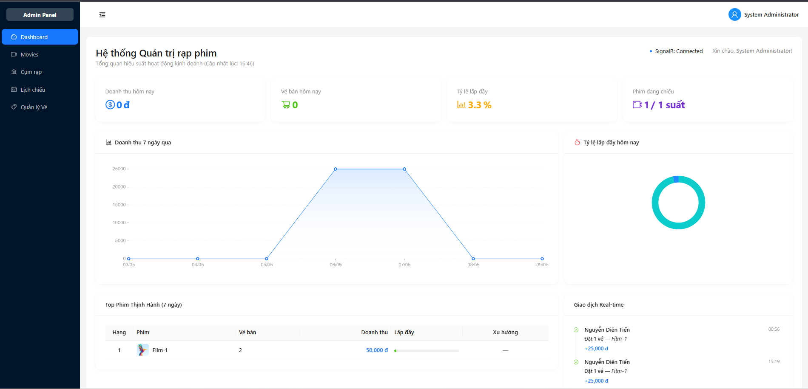

# Cinema System

A microservices-based cinema ticket booking system featuring customer frontend, admin dashboard, API Gateway, specialized backend services, real-time seat updates via SignalR, and SePay payment integration with IPN callback mechanism.

## Admin Dashboard Preview



## Quick Overview

- Frontend: `Cinema.UI` built with React 19, TypeScript, Vite, and Ant Design.
- API Gateway: `Gateway.API` using Ocelot as the client entrypoint.
- Auth: `Identity.API` manages authentication, JWT tokens, and user roles.
- Cinema domain: `Cinema.API` manages cinema complexes, screening rooms, and seats.
- Movie domain: `Movie.API` manages movies, genres, showtimes, and poster uploads via Cloudinary.
- Booking domain: `Booking.API` handles ticket bookings, real-time seat locking, and real-time dashboard.
- Payment domain: `Payment.API` processes SePay payments and IPN callbacks.
- Notification domain: `Notification.API` is a basic notification service, currently not included in the main local startup script.
- Infrastructure: SQL Server, Redis, RabbitMQ.

## Key Features

- User registration, login, and role-based authorization for Admin, Staff, and Customer.
- Browse currently showing movies, view movie details, and select showtimes.
- Real-time seat selection with SignalR.
- Create bookings with temporary seat locking using Redis.
- Payment processing via SePay with booking status updates through IPN.
- Admin dashboard for monitoring KPIs, revenue, and recent activities.
- Manage movies, cinema complexes, screening rooms, seat layouts, showtimes, and ticket operations.
- Asynchronous inter-service communication via RabbitMQ.

## System Architecture

### Architecture Overview

The system follows a microservices architecture pattern with the following layers:

**Client Layer**
- Cinema.UI: React-based frontend serving both customer and admin interfaces

**API Gateway Layer**
- Gateway.API: Central entry point using Ocelot for routing, load balancing, and request aggregation

**Service Layer**
- Identity.API: Handles authentication, authorization, and JWT token management
- Cinema.API: Manages cinema complexes, screening rooms, and seat configurations
- Movie.API: Manages movie catalog, genres, showtimes, and media assets
- Booking.API: Processes ticket bookings, seat reservations, and real-time updates
- Payment.API: Integrates with SePay payment gateway and handles payment callbacks
- Notification.API: Manages email and notification delivery

**Data Layer**
- SQL Server: Primary relational database for all services
- Redis: In-memory cache for seat locking and session management
- RabbitMQ: Message broker for asynchronous inter-service communication

**External Services**
- SePay: Payment processing gateway
- Cloudinary: Media storage and CDN for movie posters
- SMTP: Email delivery service

### Communication Patterns

**Synchronous Communication**
- Frontend communicates with all backend services through Gateway.API
- Each microservice connects directly to SQL Server for data persistence

**Asynchronous Communication**
- Booking.API and Payment.API exchange events via RabbitMQ
- Notification.API subscribes to RabbitMQ events for email triggers

**Real-time Communication**
- Booking.API uses SignalR hubs for real-time seat availability updates
- Admin dashboard receives live booking notifications through SignalR

**Caching Strategy**
- Booking.API uses Redis for temporary seat locks with TTL
- Gateway.API implements response caching for frequently accessed data

## Repository Structure

| Directory | Purpose |
|---|---|
| `Cinema.UI` | Customer and admin frontend |
| `Gateway.API` | API Gateway with Ocelot routing, CORS, and caching |
| `Identity.API` | Authentication, JWT, demo user seeding |
| `Cinema.API` | Cinema, room, and seat management |
| `Movie.API` | Movie, genre, showtime management, Cloudinary integration |
| `Booking.API` | Booking, seat locking, SignalR hub, admin dashboard |
| `Payment.API` | SePay payment processing, payment flow, IPN |
| `Notification.API` | Notification service |
| `Cinema.Shared` | Shared helpers, constants, extensions |
| `Cinema.EventBus` | Integration event contracts |
| `Cinema.EventBusRabbitMQ` | RabbitMQ event bus implementation |

## Tech Stack

### Frontend

- React 19
- TypeScript
- Vite
- Ant Design
- TanStack React Query
- Zustand
- SignalR client

### Backend

- .NET 8
- ASP.NET Core Minimal APIs
- Entity Framework Core
- SQL Server
- Redis
- RabbitMQ
- Ocelot
- SignalR
- Serilog

### External Integrations

- SePay
- Cloudinary
- SMTP
- ngrok for local IPN testing

## Key Business Flows

### Booking and Payment Flow

1. User logs in through Identity.API
2. Frontend calls Gateway to retrieve movies, cinemas, and showtimes
3. User selects seats, Booking.API locks seats in Redis and broadcasts real-time events
4. Booking is created, then Payment.API prepares SePay checkout
5. After payment completion, SePay calls IPN endpoint in Payment.API
6. Payment.API publishes event via RabbitMQ
7. Booking.API updates booking status, broadcasts SignalR to clients and admin dashboard, and sends email if SMTP is configured

### Admin Dashboard Flow

- The /admin page retrieves aggregated data from Booking.API
- Dashboard uses polling for KPIs and SignalR for real-time recent activities

## Prerequisites

- .NET SDK 8.0+
- Node.js 20+
- Docker Desktop
- PowerShell
- ngrok (if testing SePay IPN from public environment)

## Project Configuration

The repository is prepared to be safely committed to Git:

- Real files like `.env`, `appsettings.json`, `appsettings.Development.json` should not be committed.
- Each service has an `appsettings.Example.json` or similar template file.

### 1. Create Environment Files

```powershell
Copy-Item .env.example .env
Copy-Item Cinema.UI\.env.example Cinema.UI\.env
```

### 2. Create Local Configuration Files for Each Service

```powershell
Copy-Item Identity.API\appsettings.Example.json Identity.API\appsettings.json
Copy-Item Cinema.API\appsettings.Example.json Cinema.API\appsettings.json
Copy-Item Movie.API\appsettings.Example.json Movie.API\appsettings.json
Copy-Item Booking.API\appsettings.Example.json Booking.API\appsettings.json
Copy-Item Payment.API\appsettings.Example.json Payment.API\appsettings.json
Copy-Item Gateway.API\appsettings.Example.json Gateway.API\appsettings.json
Copy-Item Notification.API\appsettings.Example.json Notification.API\appsettings.json
```

If you need local override files:

```powershell
Copy-Item Booking.API\appsettings.Development.Example.json Booking.API\appsettings.Development.json
Copy-Item Gateway.API\appsettings.Development.Example.json Gateway.API\appsettings.Development.json
Copy-Item Payment.API\appsettings.Development.Example.json Payment.API\appsettings.Development.json
```

### 3. Fill in Real Secrets

You need to fill in actual values for your environment:

- SQL Server connection strings
- JWT secret
- SMTP account and app password
- Cloudinary credentials
- SePay merchant configuration
- ngrok callback URL for IPN if testing locally

## Running the Project

There are 2 approaches suitable for the current repository state.

### Option 1. Local Development (Recommended)

Run infrastructure with Docker, while running APIs and frontend locally for easier debugging.

#### Step 1. Start Infrastructure

```powershell
docker compose up -d sqlserver redis rabbitmq
```

`docker-compose.override.yml` maps the following host ports:

- SQL Server: `localhost:11433`
- Redis: `localhost:6379`
- RabbitMQ: `localhost:5672`
- RabbitMQ UI: `http://localhost:15672`

#### Step 2. Run Migrations

```powershell
.\scripts\run-migrations.ps1
```

#### Step 3. Run Backend Locally

```powershell
.\scripts\run-all-services.ps1
```

This script currently starts:

- Gateway: `https://localhost:7100`
- Identity Swagger: `https://localhost:7012/swagger`
- Cinema Swagger: `https://localhost:7251/swagger`
- Movie Swagger: `https://localhost:7295/swagger`
- Booking Swagger: `https://localhost:7043/swagger`
- Payment Swagger: `https://localhost:7252/swagger`

Note:

- `Notification.API` is not currently started by this script.
- If running frontend locally in this mode, configure `Cinema.UI/.env`:

```env
VITE_API_GATEWAY_URL=https://localhost:7100
```

#### Step 4. Run Frontend

```powershell
cd Cinema.UI
npm install
npm run dev
```

Frontend runs by default at:

- `http://localhost:5173`

### Option 2. Run Backend with Docker Compose

```powershell
docker compose up -d --build
```

Current state of `docker-compose.yml`:

- Starts core backend services and Gateway.
- Gateway is exposed to host at `http://localhost:5200`.
- Frontend is not currently containerized in compose.
- `Notification.API` is not currently in compose.

If using this mode, local frontend should point to:

```env
VITE_API_GATEWAY_URL=http://localhost:5200
```

## Pre-seeded Demo Accounts

In `Identity.API`, the system seeds sample users for development environment:

| Role | Email | Password |
|---|---|---|
| Admin | `admin@cinema.com` | `Admin@123` |
| Staff | `staff@cinema.com` | `Staff@123` |
| Customer | `customer1@example.com` | `Customer@123` |

For development only, do not reuse in production.

## Key URLs to Check First

### Frontend

- Local UI: `http://localhost:5173`

### Gateway

- Local script mode: `https://localhost:7100`
- Docker Compose mode: `http://localhost:5200`
- Health check: `/health`

### Backend Local Swagger

- Identity: `https://localhost:7012/swagger`
- Cinema: `https://localhost:7251/swagger`
- Movie: `https://localhost:7295/swagger`
- Booking: `https://localhost:7043/swagger`
- Payment: `https://localhost:7252/swagger`

### Infrastructure

- RabbitMQ UI: `http://localhost:15672`
- SQL Server host port: `11433`
- Redis host port: `6379`

## Real-time and Dashboard

`Booking.API` currently publishes the following hubs:

- `/hubs/seats`
- `/hubs/booking`
- `/hubs/admin-dashboard`

The frontend admin dashboard listens to the `/hubs/admin-dashboard` hub through Gateway to receive real-time new booking activities.

## Useful Scripts

All scripts are located in the `scripts/` folder.

| Script | Purpose |
|---|---|
| `scripts/run-all-services.ps1` | Quickly run main backend services locally |
| `scripts/run-migrations.ps1` | Create or apply database migrations |
| `scripts/start-ngrok-payment.ps1` | Open tunnel for testing SePay IPN |
| `scripts/check-ngrok-status.ps1` | Check ngrok tunnel status |
| `scripts/test-auth-flow.ps1` | Test authentication flow |
| `scripts/test-email.ps1` | Test email sending from Booking |
| `scripts/test-ipn-endpoint.ps1` | Test Payment IPN endpoint |
| `scripts/verify-ngrok-urls.ps1` | Verify ngrok callback URLs |

## API Collection

The repository includes a Postman collection:

- `CinemaSystem.postman_collection.json`

Note that you should update collection variables to match your current local ports before use.

## Security Notes

- Do not commit `.env` or real `appsettings*.json` files.
- Only commit template files like `*.Example.json`.
- Change all demo secrets before real deployment.
- For local SePay IPN, always use a valid public HTTPS URL, for example via ngrok.

## Future Development

- Include `Notification.API` in compose or local startup script.
- Further standardize port documentation between local, script, and docker modes.
- Add CI, automated testing, and production deployment documentation.

