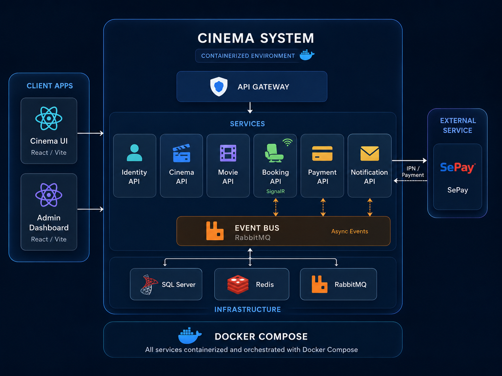

# Cinema System

Cinema System is a microservices-based movie ticket booking application. It includes a customer/admin frontend, an API Gateway, independent backend services, real-time seat updates, and SePay payment integration.

## Architecture



## Services

| Project | Responsibility |
|---|---|
| `Cinema.UI` | React frontend for customers and admins |
| `Gateway.API` | API Gateway powered by Ocelot |
| `Identity.API` | Registration, login, JWT authentication, authorization |
| `Cinema.API` | Cinema, hall, and seat management |
| `Movie.API` | Movie, genre, showtime, and Cloudinary poster management |
| `Booking.API` | Booking, temporary seat locking, and SignalR real-time updates |
| `Payment.API` | Payment creation and SePay IPN handling |
| `Notification.API` | Email notifications |
| `Cinema.Shared` | Shared code for auth, models, helpers, and migrations |
| `Cinema.Contracts` | RabbitMQ event contracts |

## Tech Stack

**Frontend**

- React 19, TypeScript, Vite
- Ant Design, Ant Design Charts
- React Router, TanStack React Query
- Axios, Zustand, React Hook Form, Zod
- SignalR client

**Backend**

- .NET 8, ASP.NET Core Minimal APIs
- Entity Framework Core, SQL Server
- Ocelot API Gateway
- Redis for caching, seat locking, and SignalR backplane
- RabbitMQ + MassTransit for event-driven communication
- SignalR for real-time updates
- JWT Bearer Authentication
- Swagger/OpenAPI
- Serilog in the Gateway

**External / Infrastructure**

- SePay payment gateway
- Cloudinary image storage
- SMTP email
- Docker, Docker Compose
- ngrok for local SePay IPN testing

## Main Flow

1. A user signs in through `Identity.API` and receives a JWT.
2. The frontend calls backend services through `Gateway.API`.
3. The user selects seats, and `Booking.API` locks them in Redis and broadcasts updates through SignalR.
4. A booking is created, and `Payment.API` prepares the SePay payment.
5. SePay calls the IPN endpoint in `Payment.API`.
6. `Payment.API` publishes an event through RabbitMQ.
7. `Booking.API` updates the booking status and sends real-time updates.
8. `Notification.API` can send an email when it receives a successful payment event.

## Run Locally

### 1. Start infrastructure

```powershell
docker compose up -d sqlserver redis rabbitmq
```

Ports:

- SQL Server: `localhost:11433`
- Redis: `localhost:6379`
- RabbitMQ: `localhost:5672`
- RabbitMQ UI: `http://localhost:15672`

### 2. Create config files

```powershell
Copy-Item .env.example .env
Copy-Item Cinema.UI\.env.example Cinema.UI\.env
Copy-Item Identity.API\appsettings.Example.json Identity.API\appsettings.json
Copy-Item Cinema.API\appsettings.Example.json Cinema.API\appsettings.json
Copy-Item Movie.API\appsettings.Example.json Movie.API\appsettings.json
Copy-Item Booking.API\appsettings.Example.json Booking.API\appsettings.json
Copy-Item Payment.API\appsettings.Example.json Payment.API\appsettings.json
Copy-Item Gateway.API\appsettings.Example.json Gateway.API\appsettings.json
Copy-Item Notification.API\appsettings.Example.json Notification.API\appsettings.json
```

Then fill in the required values: SQL Server connection strings, JWT secret, Cloudinary, SePay, and SMTP settings.

### 3. Run migrations

```powershell
.\scripts\run-migrations.ps1
```

### 4. Run backend services

```powershell
.\scripts\run-all-services.ps1
```

Local Swagger endpoints:

- Identity: `https://localhost:7012/swagger`
- Cinema: `https://localhost:7251/swagger`
- Movie: `https://localhost:7295/swagger`
- Booking: `https://localhost:7043/swagger`
- Payment: `https://localhost:7252/swagger`
- Gateway: `https://localhost:7100`

### 5. Run frontend

```powershell
cd Cinema.UI
npm install
npm run dev
```

Frontend URL: `http://localhost:5173`

## Run With Docker Compose

```powershell
docker compose up -d --build
```

Gateway is exposed at:

```env
VITE_API_GATEWAY_URL=http://localhost:5200
```

## Demo Accounts

| Role | Email | Password |
|---|---|---|
| Admin | `admin@cinema.com` | `Admin@123` |
| Staff | `staff@cinema.com` | `Staff@123` |
| Customer | `customer1@example.com` | `Customer@123` |

## Useful Scripts

| Script | Purpose |
|---|---|
| `scripts/run-all-services.ps1` | Run backend services locally |
| `scripts/run-migrations.ps1` | Create/apply database migrations |
| `scripts/start-ngrok-payment.ps1` | Open a tunnel for SePay IPN testing |
| `scripts/check-ngrok-status.ps1` | Check the ngrok tunnel |
| `scripts/test-auth-flow.ps1` | Test the authentication flow |
| `scripts/test-email.ps1` | Test email sending |
| `scripts/test-ipn-endpoint.ps1` | Test the Payment IPN endpoint |

## Notes

- Do not commit `.env`, `appsettings.json`, or `appsettings.Development.json` files that contain real secrets.
- Only commit template files such as `*.Example.json`.
- The frontend is not containerized in `docker-compose.yml`.
