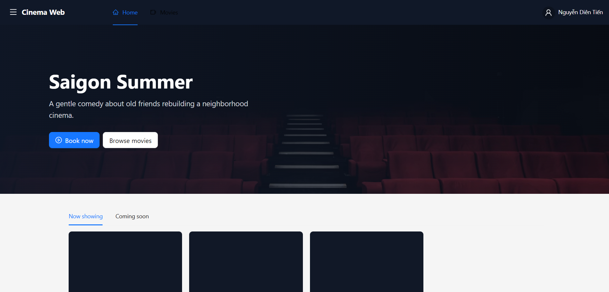
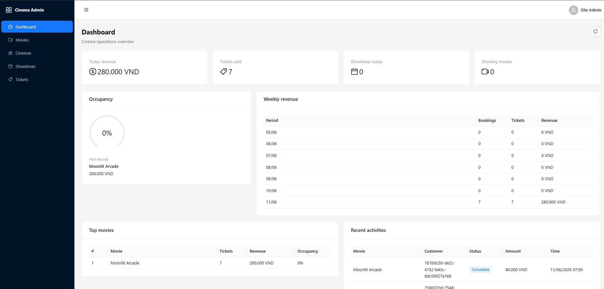

# Cinema System

Cinema System is a movie ticket booking demo built with a microservices architecture and .NET Aspire. The current version has two separate React applications:

- `Cinema.Web`: customer-facing web app.
- `Cinema.Web.Admin`: administration web app.

The backend uses PostgreSQL, Redis, RabbitMQ/MassTransit, YARP Gateway, JWT authentication, SignalR realtime updates, Cloudinary image uploads, SePay checkout/IPN, and SMTP email for successful payment confirmations.

## Demo Screenshots





## Project Map

| Project | Responsibility |
|---|---|
| `Cys.AppHost` | Aspire orchestration for APIs, Gateway, PostgreSQL, Redis, RabbitMQ, and ngrok |
| `Gateway` | YARP API Gateway for `/api/v1/...` and `/hubs/...` |
| `Identity.API` | Registration, login, JWT, refresh tokens, users, and admin access |
| `Cinema.API` | Cinemas, halls, and seat layouts |
| `Movie.API` | Movies, genres, showtimes, and Cloudinary posters |
| `Booking.API` | Seat availability, Redis seat locks, bookings, tickets, dashboard, SignalR, and email |
| `Payment.API` | Payment creation, SePay checkout, SePay IPN, and payment events |
| `Contract` | Shared RabbitMQ/MassTransit event contracts |
| `*.API.Client` | Typed HTTP clients for service-to-service calls |
| `Cinema.Web` | Customer web app, React + TS + AntD, port `19877` |
| `Cinema.Web.Admin` | Admin web app, React + TS + AntD, port `19876` |

## Main Features

- JWT authentication through the Gateway.
- Admin management for movies, genres, cinemas, halls, seat maps, and showtimes.
- Customer movie browsing, showtime selection, seat map, seat locking, booking, and checkout.
- Redis stores temporary seat locks/cache and is not the source of truth.
- Booking DB is the source of truth for bookings and tickets.
- Cinema/Movie services are the source of truth for hall layouts, seats, movies, and showtimes.
- RabbitMQ/MassTransit pub/sub:
  - `BookingCreatedEvent`
  - `BookingCancelledEvent`
  - `BookingExpiredEvent`
  - `PaymentCompletedEvent`
  - `PaymentFailedEvent`
- SignalR realtime:
  - `/hubs/seats`: seat map updates by showtime.
  - `/hubs/booking`: booking status updates for customers.
  - `/hubs/admin-dashboard`: admin dashboard refresh.
- Booking confirmation email after payment is completed and the booking is confirmed.

## Demo Accounts

Identity seeding creates users and roles when the service starts.

| Role | Email | Password |
|---|---|---|
| Admin | `admin@123.local` | `Admin123!` |
| Customer | `demo@123.local` | `Demo123!` |

## Prerequisites

- .NET SDK matching the solution target, currently `net10.0`.
- Docker Desktop.
- Node.js and npm.
- `dotnet-ef`, if you need to create or apply migrations manually.
- ngrok, if you want to test SePay IPN from the internet to local.

Install or update `dotnet-ef` if needed:

```powershell
dotnet tool install --global dotnet-ef
dotnet tool update --global dotnet-ef
```

## Configuration

Store all secrets in `Cys.AppHost` user-secrets. Do not commit real secrets to `appsettings*.json`.

### Required AppHost Parameters

```powershell
dotnet user-secrets set "Parameters:jwt-key" "your-long-local-jwt-key-at-least-32-chars" --project Cys.AppHost
dotnet user-secrets set "Parameters:jwt-issuer" "CinemaSystem" --project Cys.AppHost
dotnet user-secrets set "Parameters:jwt-audience" "CinemaSystem.Client" --project Cys.AppHost

dotnet user-secrets set "Parameters:cloudinary-cloud-name" "<cloud-name>" --project Cys.AppHost
dotnet user-secrets set "Parameters:cloudinary-api-key" "<api-key>" --project Cys.AppHost
dotnet user-secrets set "Parameters:cloudinary-api-secret" "<api-secret>" --project Cys.AppHost

dotnet user-secrets set "Parameters:sepay-merchant-id" "<merchant-id>" --project Cys.AppHost
dotnet user-secrets set "Parameters:sepay-secret-key" "<secret-key>" --project Cys.AppHost

dotnet user-secrets set "Parameters:openai-api-key" "<openai-api-key>" --project Cys.AppHost
```

### Optional Email Parameters

Configure these if you want booking confirmation emails after successful payment:

```powershell
dotnet user-secrets set "Parameters:email-smtp-host" "<smtp-host>" --project Cys.AppHost
dotnet user-secrets set "Parameters:email-smtp-port" "587" --project Cys.AppHost
dotnet user-secrets set "Parameters:email-smtp-username" "<smtp-username>" --project Cys.AppHost
dotnet user-secrets set "Parameters:email-smtp-password" "<smtp-password>" --project Cys.AppHost
dotnet user-secrets set "Parameters:email-from" "Cinema System <no-reply@example.com>" --project Cys.AppHost
```

### Optional ngrok Domain

If you have a static ngrok domain:

```powershell
dotnet user-secrets set "Ngrok:Domain" "your-domain.ngrok-free.app" --project Cys.AppHost
```

## Run Backend

Run the full backend with Aspire:

```powershell
dotnet run --project Cys.AppHost
```

AppHost starts:

- PostgreSQL + PgWeb.
- Redis + Redis Insight.
- RabbitMQ + Management UI.
- `identity`, `cinema`, `movie`, `booking`, `payment`, and `gateway`.
- `ngrok-gateway`, if ngrok is installed.

Gateway local URLs:

```text
https://localhost:55000
http://localhost:55001
```

All frontend traffic should go through the Gateway:

```text
https://localhost:55000/api/v1/...
```

SignalR also goes through the Gateway:

```text
https://localhost:55000/hubs/seats
https://localhost:55000/hubs/booking
https://localhost:55000/hubs/admin-dashboard
```

## Run Frontend

Each frontend has a `.env.example`:

```text
VITE_API_GATEWAY_URL=https://localhost:55000
```

Copy it to `.env` and change the Gateway URL if needed.

### Customer Web

```powershell
cd Cinema.Web
npm install
npm run dev
```

URL:

```text
http://localhost:19877
```

### Admin Web

```powershell
cd Cinema.Web.Admin
npm install
npm run dev
```

URL:

```text
http://localhost:19876
```

## Demo Flow

### Admin Flow

1. Open `http://localhost:19876`.
2. Log in with `admin@123.local` / `Admin123!`.
3. Check the dashboard.
4. Create or update movies and upload posters.
5. Review cinemas, halls, and seat maps.
6. Create a showtime with movie, cinema hall, start time, and price.
7. The dashboard refreshes in realtime when a booking is completed.

### Customer Flow

1. Open `http://localhost:19877`.
2. Log in with `demo@123.local` / `Demo123!`.
3. Choose a movie and showtime.
4. Open the seat map and select seats.
5. Seats are locked in Redis and broadcast through SignalR.
6. Create a booking. Payment service creates the checkout session.
7. After payment is completed:
   - Payment publishes `PaymentCompletedEvent`.
   - Booking consumes the event and confirms the booking.
   - BookingHub notifies the customer.
   - AdminDashboardHub notifies the admin dashboard to refresh.
   - Confirmation email is sent best-effort if SMTP is configured.

## SePay And ngrok

SePay IPN should point to the Gateway, not directly to Payment API.

IPN URL:

```text
https://<ngrok-domain>/api/v1/payments/sepay/ipn
```

Gateway also supports the legacy URL:

```text
https://<ngrok-domain>/api/payments/sepay/ipn
```

To start ngrok with the helper script:

```powershell
.\scripts\start-ngrok-payment.ps1
```

## Database And Migrations

Services run database migrations on startup. If you need to run EF manually, the design-time factories read these environment variables:

- `ConnectionStrings__identitydb`
- `ConnectionStrings__cinemadb`
- `ConnectionStrings__moviedb`
- `ConnectionStrings__bookingdb`
- `ConnectionStrings__paymentdb`

Local fallback:

```text
Host=localhost;Database=<db-name>;Username=postgres;Password=postgres
```

Apply migrations manually:

```powershell
dotnet ef database update --project Identity.API --startup-project Identity.API --context IdentityDbContext
dotnet ef database update --project Cinema.API --startup-project Cinema.API --context CinemaDbContext
dotnet ef database update --project Movie.API --startup-project Movie.API --context MovieDbContext
dotnet ef database update --project Booking.API --startup-project Booking.API --context BookingDbContext
dotnet ef database update --project Payment.API --startup-project Payment.API --context PaymentDbContext
```

## Useful Checks

Build backend:

```powershell
dotnet build Gateway/Gateway.csproj
dotnet build Identity.API/Identity.API.csproj
dotnet build Cinema.API/Cinema.API.csproj
dotnet build Movie.API/Movie.API.csproj
dotnet build Booking.API/Booking.API.csproj
dotnet build Payment.API/Payment.API.csproj
dotnet build Cys.AppHost/Cys.AppHost.csproj
```

Build frontend:

```powershell
cd Cinema.Web
npm run build

cd ..\Cinema.Web.Admin
npm run build
```

## Troubleshooting

- If the frontend gets CORS errors, make sure it calls Gateway `https://localhost:55000` and runs on port `19876` or `19877`.
- If SignalR cannot connect, check the login token and the `/hubs/...` route through Gateway.
- If SePay reports a missing MerchantId or SecretKey, check `Cys.AppHost` user-secrets, not `Payment.API` user-secrets.
- If Redis loses data, the seat map is seeded again from Cinema/Movie/Booking data when availability is requested. Redis is not the source of truth.
- If RabbitMQ consumers are not running, check that AppHost started RabbitMQ and that Booking/Payment are waiting for `rabbitmq`.
- If a frontend port is already in use, stop the process holding the port or change `server.port` in `vite.config.ts`.

## Notes For Development

- Gateway is the external path: UI -> Gateway -> service.
- Service-to-service traffic goes directly through Aspire references, not through Gateway by default.
- Do not commit secrets, local user files, runtime logs, `.vs`, `.vscode`, `node_modules`, `bin`, or `obj`.
- SignalR is only for realtime notifications. It is not a source of truth.
- Email failures only log warnings and do not roll back confirmed bookings.
