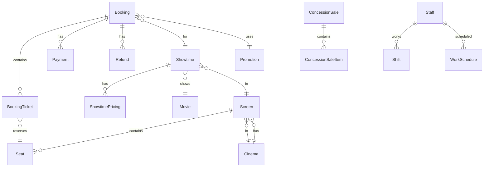
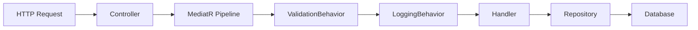
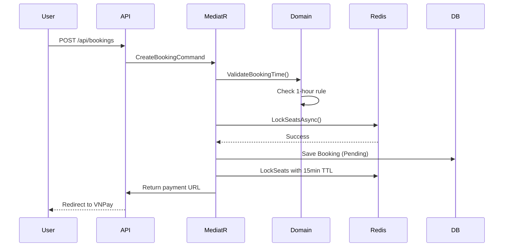
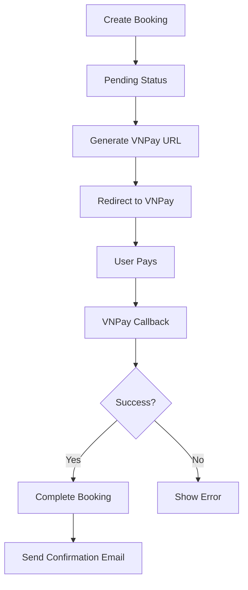

# Cinema System - Technical Analysis for Interview

## 1. Technology Stack

### 1.1 Backend Framework

- **.NET 8.0** - Latest LTS version of .NET
- **ASP.NET Core 8.0** - Web API framework
- **Entity Framework Core 8.0.19** - ORM for database operations

### 1.2 Programming Language

- **C# 12** - Primary language with nullable reference types enabled

### 1.3 Key Libraries & Packages

| Package                                       | Version | Purpose                                 |
| --------------------------------------------- | ------- | --------------------------------------- |
| MediatR                                       | 12.4.1  | CQRS pattern implementation             |
| FluentValidation                              | 11.3.1  | Input validation                        |
| Ardalis.Specification                         | 9.3.0   | Query specifications                    |
| Microsoft.AspNetCore.Authentication.JwtBearer | 8.0.19  | JWT authentication                      |
| System.IdentityModel.Tokens.Jwt               | 8.14.0  | JWT token handling                      |
| Swashbuckle.AspNetCore                        | 6.6.2   | Swagger/OpenAPI documentation           |
| StackExchange.Redis                           | -       | Redis client for caching & seat locking |
| Microsoft.EntityFrameworkCore.SqlServer       | 8.0.19  | SQL Server provider                     |

### 1.4 Infrastructure

| Service   | Technology                   | Purpose                           |
| --------- | ---------------------------- | --------------------------------- |
| Database  | SQL Server 2022              | Primary data store                |
| Cache     | Redis 7                      | Distributed caching, seat locking |
| Email     | SMTP (Gmail) / Mailhog (dev) | Transactional emails              |
| Real-time | SignalR with Redis           | Real-time seat updates            |

### 1.5 Architecture Pattern

- **Clean Architecture** (Onion Architecture)
- **CQRS Pattern** with MediatR
- **Domain-Driven Design** (DDD)

---

## 2. Project Structure (Clean Architecture)

```
cinemaSystem/
├── Api/                    # Presentation Layer (ASP.NET Core Web API)
│   ├── Controllers/        # API endpoints
│   ├── Middleware/         # Exception handlers
│   ├── BackgroundServices/ # Background tasks
│   └── Convertors/         # JSON converters
│
├── Application/            # Application Layer (Use Cases)
│   ├── Features/           # CQRS Commands & Queries
│   │   └── [Feature]/
│   │       ├── Commands/   # Write operations
│   │       ├── Queries/    # Read operations
│   │       └── EventHandlers/
│   ├── Common/
│   │   ├── Behaviors/     # MediatR pipeline behaviors
│   │   ├── Exceptions/    # Custom exceptions
│   │   └── Interfaces/    # Abstractions
│   └── DependencyInjection.cs
│
├── Domain/                 # Domain Layer (Business Logic)
│   ├── Entities/           # Domain entities (Aggregates)
│   │   ├── BookingAggregate/
│   │   ├── CinemaAggregate/
│   │   ├── MovieAggregate/
│   │   ├── ShowtimeAggregate/
│   │   └── ...
│   ├── Services/           # Domain services
│   ├── Events/             # Domain events
│   └── Common/             # Base classes
│
├── Infrastructure/         # Infrastructure Layer
│   ├── Data/               # EF Core contexts & configurations
│   ├── Identity/           # ASP.NET Identity
│   ├── Redis/              # Redis services
│   ├── Payments/           # Payment gateway integration
│   ├── Hubs/               # SignalR hubs
│   └── ExternalServices/   # Email, external APIs
│
├── Shared/                 # Shared Kernel
│   ├── Common/             # Shared utilities (Paging, QR)
│   ├── Models/             # DTOs
│   └── Templates/          # Email templates
│
└── Tests/                  # Unit & Integration tests
```

---

## 3. Database Design (SQL Server)

### 3.1 Database Contexts (Multi-DB Strategy)

The system uses **two separate databases**:

1. **BookingContext** - Main business data
   - Booking, Showtime, Cinema, Movie, Concession, etc.

2. **AppIdentityContext** - Identity & Authentication
   - AspNetUsers, AspNetRoles, AspNetUserRoles, etc.

### 3.2 Key Entities & Relationships



### 3.3 Booking Status Flow

```
Pending -> Completed -> (Optional: PendingRefund -> Refunded)
         -> Cancelled
```

---

## 4. Business Logic (Domain Layer)

### 4.1 Domain Services

#### **BookingRules** (`Domain/Services/BookingRules.cs`)

Enforces booking creation rules:

- **Rule 1**: Cannot book within 1 hour of showtime
- **Rule 2**: Maximum 8 tickets per booking
- **Rule 3**: Must have enough available seats
- **Rule 4**: All seats must be bookable (active, not blocked)
- **Rule 5**: Couple seats must be booked as pairs

#### **RefundPolicy** (`Domain/Services/RefundPolicy.cs`)

Refund calculation based on time before showtime:

| Hours Before Showtime | Refund Percentage |
| --------------------- | ----------------- |
| > 24 hours            | 100%              |
| 12-24 hours           | 80%               |
| 4-12 hours            | 50%               |
| < 4 hours             | 0% (No refund)    |

Additional rule: Cannot refund after check-in.

### 4.2 Domain Events

| Event                 | Trigger              | Purpose                             |
| --------------------- | -------------------- | ----------------------------------- |
| BookingCreatedEvent   | New booking created  | Lock seats, send notification       |
| BookingCompletedEvent | Payment successful   | Update inventory, send confirmation |
| BookingCancelledEvent | Booking cancelled    | Release seats, notify user          |
| RefundRequestedEvent  | User requests refund | Process refund workflow             |
| BookingRefundedEvent  | Refund approved      | Update status, notify user          |
| LowStockAlertEvent    | Inventory low        | Alert staff                         |

---

## 5. CQRS Implementation (MediatR)

### 5.1 Command/Query Structure

Each feature follows this pattern:

```csharp
// Command - Write Operation
public record CreateBookingCommand(...) : IRequest<CreateBookingResult>;
public class CreateBookingHandler : IRequestHandler<CreateBookingCommand, CreateBookingResult> { }

// Query - Read Operation
public record GetBookingByIdQuery(Guid Id) : IRequest<BookingDetailDto>;
public class GetBookingByIdHandler : IRequestHandler<GetBookingByIdQuery, BookingDetailDto> { }
```

### 5.2 MediatR Pipeline Behaviors



**ValidationBehavior**: Auto-validates using FluentValidation before handler execution

**LoggingBehavior**: Logs request name, execution time, warns on slow requests (>500ms)

### 5.3 Booking Flow Example



---

## 6. Authentication & Authorization

### 6.1 JWT Authentication

- **Access Token**: 20 minutes expiry
- **Refresh Token**: 7 days expiry (stored in Redis)
- **Algorithm**: HMAC-SHA256
- **Claims**: Name, NameIdentifier, Email, Roles

### 6.2 Roles & Permissions

| Role       | Description          | Permissions                   |
| ---------- | -------------------- | ----------------------------- |
| SuperAdmin | System administrator | Full system access            |
| Admin      | Cinema admin         | Manage movies, promotions     |
| Manager    | Cinema manager       | Manage showtimes, staff       |
| Staff      | Counter staff        | Process bookings, concessions |
| Customer   | End user             | Book tickets, view history    |

### 6.3 Identity Configuration

```csharp
options.Password.RequireDigit = true;
options.Password.RequiredLength = 8;
options.Password.RequireLowercase = true;
options.Password.RequireUppercase = true;
options.Password.RequireNonAlphanumeric = true;
options.SignIn.RequireConfirmedAccount = false;
options.User.RequireUniqueEmail = true;
```

---

## 7. Real-time Features (SignalR)

### 7.1 SeatHub

Real-time seat selection updates:

```csharp
[Authorize]
public class SeatHub : Hub
{
    // Join showtime group to receive updates
    public async Task JoinShowtimeGroup(Guid showtimeId);

    // Notify others when seat is being selected
    public async Task SelectSeat(Guid showtimeId, Guid seatId);

    // Notify others when seat is unselected
    public async Task UnselectSeat(Guid showtimeId, Guid seatId);
}
```

### 7.2 SignalR with Redis Backplane

- Uses StackExchange.Redis for message scaling
- Enables horizontal scaling of SignalR instances
- `/seatHub` endpoint for real-time updates

---

## 8. Redis Implementation

### 8.1 Seat Locking (Atomic Operations)

Uses **Lua script** for atomic multi-seat locking:

```csharp
// All seats locked together or none
// If any seat fails to lock, rollback previously locked seats
// TTL: 15 minutes (configurable)
```

### 8.2 Cache Keys

| Key Pattern                                       | Purpose               |
| ------------------------------------------------- | --------------------- |
| `cinema:showtime:{showtimeId}:seat:{seatId}:lock` | Seat lock status      |
| `refresh_token:{userId}`                          | Refresh token storage |
| Cache via ICacheService                           | Generic caching       |

---

## 9. Payment Integration

### 9.1 VNPay Gateway

- **Sandbox URL**: `https://sandbox.vnpayment.vn/paymentv2/vpcpay.html`
- **Callback URL**: `/api/Bookings/callback`
- **Process**:
  1. Create booking (Pending status)
  2. Generate VNPay payment URL
  3. User redirected to VNPay
  4. VNPay calls back with result
  5. Complete booking (change to Completed)

### 9.2 Payment Flow



---

## 10. Background Services

### 10.1 BookingExpiryService

- Runs every 1 minute
- Checks for expired pending bookings
- Cancels bookings and releases seats
- Uses MediatR command: `CancelExpiredBookingsCommand`

---

## 11. API Endpoints Overview

### 11.1 Controllers

| Controller            | Purpose                           |
| --------------------- | --------------------------------- |
| BookingsController    | Booking CRUD, payment, check-in   |
| MoviesController      | Movie management                  |
| ShowtimesController   | Showtime management               |
| CinemasController     | Cinema management                 |
| ConcessionsController | Concession sales                  |
| AuthController        | Login, register, refresh token    |
| IdentityController    | User profile, password management |
| PromotionsController  | Promo code management             |
| DashboardController   | Analytics & reporting             |

---

## 12. Key Design Patterns Used

| Pattern                   | Implementation                              |
| ------------------------- | ------------------------------------------- |
| **Repository Pattern**    | IBookingRepository, IShowtimeRepository     |
| **Unit of Work**          | IUnitOfWork                                 |
| **CQRS**                  | MediatR Commands/Queries                    |
| **Domain Events**         | INotificationHandler for events             |
| **Specification Pattern** | Ardalis.Specification                       |
| **Factory Method**        | Booking.Create(), Booking.CreateAtCounter() |
| **Strategy Pattern**      | IPaymentGateway (VNPay)                     |
| **Dependency Injection**  | Microsoft DI container                      |
| **Middleware**            | Exception handling middleware               |
| **Pipeline Behavior**     | Validation, Logging                         |

---

## 13. Exception Handling

### 13.1 Custom Exceptions

- `NotFoundException` - Resource not found
- `ConflictException` - Business rule violation
- `ValidationException` - Input validation failure
- `UnauthorizedException` - Authentication failure
- `ForbiddenException` - Authorization failure
- `DomainException` - Domain rule violation

### 13.2 Exception Handlers (Middleware)

- `ValidationExceptionHandler` - FluentValidation errors
- `DomainExceptionHandler` - Business logic errors
- `GlobalExceptionHandler` - Unhandled errors

---

## 14. Testing

- **xUnit** - Test framework
- **FluentAssertions** - Assertion library
- **Moq** - Mocking framework

Example test location:

```
Tests/CinemaSystem.UnitTests/Application/Features/Bookings/Commands/CreateBooking/
```

---

## 15. Docker Infrastructure

```yaml
services:
  api: # ASP.NET Core API (port 8080, 8081)
  sqlserver: # SQL Server 2022 (port 1433)
  redis: # Redis 7 (port 6379)
  mailhog: # Email testing (SMTP 1025, Web 8025)
```

---

## 16. Configuration (appsettings.json)

### 16.1 Key Settings

- **JWT**: SecretKey, Issuer, Audience, Token expiration
- **VNPay**: TmnCode, HashSecret, BaseUrl
- **SMTP**: Server, Port, Credentials
- **Redis**: Connection string
- **ConnectionStrings**: BookingConnection, IdentityConnection

---

## 17. Interview Key Points Summary

### Must Know:

1. **Clean Architecture** - Layer separation (Api → Application → Domain → Infrastructure)
2. **CQRS with MediatR** - Command/Query separation
3. **Domain-Driven Design** - Aggregates, Entities, Domain Events
4. **JWT Authentication** - Token-based auth with refresh tokens
5. **Redis Seat Locking** - Lua script for atomic operations
6. **SignalR** - Real-time updates
7. **Multi-Database** - Identity vs Business data separation
8. **FluentValidation** - Input validation pipeline
9. **Background Services** - Booking expiry cleanup

### Can Mention:

1. **Specification Pattern** - Complex queries
2. **Domain Events** - Event-driven architecture
3. **Event Sourcing potential** - Domain events stored
4. **Payment Integration** - VNPay flow
5. **Docker** - Containerized deployment

---

_Generated for interview preparation_
