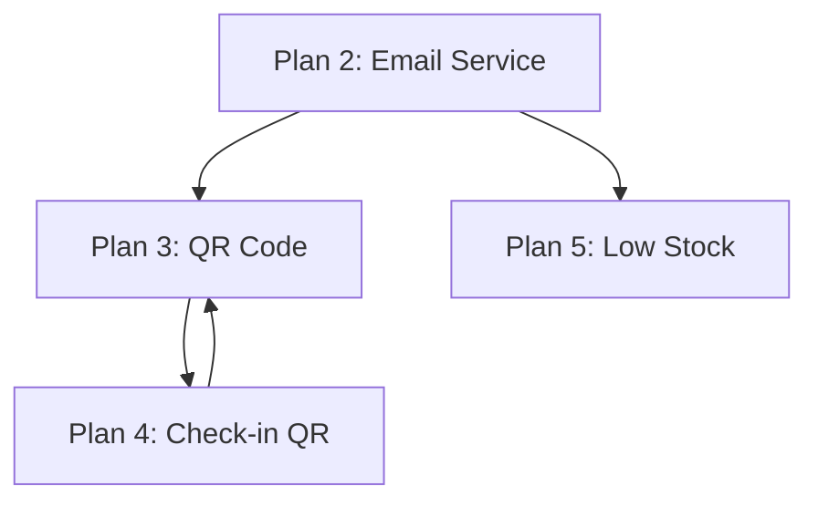

# PLANS PHÁT TRIỂN NGHIỆP VỤ - HỆ THỐNG RẠP CHIẾU PHIM

## Mục lục

1. [Plan 1: Quản lý Promotions (Update/Delete API)](#plan-1-quản-lý-promotions)
2. [Plan 2: Email Service Implementation](#plan-2-email-service)
3. [Plan 3: QR Code / E-ticket Generation](#plan-3-qr-code--e-ticket)
4. [Plan 4: Check-in với QR Code](#plan-4-check-in-với-qr-code)
5. [Plan 5: Low Stock Notification](#plan-5-low-stock-notification)
6. [Plan 6: Payment Callback Config](#plan-6-payment-callback-config)

---

## Plan 1: Quản lý Promotions (Update/Delete API)

### Mô tả

Bổ sung các API để quản lý khuyến mãi: Update, Delete, Deactivate

### Files cần tạo/sửa

| Loại   | Đường dẫn                                                                                    |
| ------ | -------------------------------------------------------------------------------------------- |
| NEW    | `Application/Features/Promotions/Commands/UpdatePromotion/UpdatePromotionCommand.cs`         |
| NEW    | `Application/Features/Promotions/Commands/UpdatePromotion/UpdatePromotionHandler.cs`         |
| NEW    | `Application/Features/Promotions/Commands/UpdatePromotion/UpdatePromotionValidator.cs`       |
| NEW    | `Application/Features/Promotions/Commands/DeletePromotion/DeletePromotionCommand.cs`         |
| NEW    | `Application/Features/Promotions/Commands/DeletePromotion/DeletePromotionHandler.cs`         |
| NEW    | `Application/Features/Promotions/Commands/DeactivatePromotion/DeactivatePromotionCommand.cs` |
| NEW    | `Application/Features/Promotions/Commands/DeactivatePromotion/DeactivatePromotionHandler.cs` |
| UPDATE | `Api/Controllers/PromotionsController.cs` - Thêm endpoints                                   |

### Tasks chi tiết

```markdown
- [ ] 1. Tạo UpdatePromotionCommand.cs với các fields có thể update
- [ ] 2. Tạo UpdatePromotionHandler.cs - Validate và cập nhật promotion
- [ ] 3. Tạo UpdatePromotionValidator.cs - Validate input
- [ ] 4. Tạo DeletePromotionCommand.cs + Handler
- [ ] 5. Tạo DeactivatePromotionCommand.cs + Handler (soft delete)
- [ ] 6. Update PromotionsController - Thêm [Authorize] và endpoints
- [ ] 7. Cập nhật IPromotionRepository nếu cần
```

### Business Rules

- Chỉ Admin/Manager mới được thao tác
- Không thể update promotion đang active nếu có booking sử dụng
- Deactivate = soft delete, không xóa vật lý

---

## Plan 2: Email Service Implementation

### Mô tả

Implement Email Service để gửi email xác nhận đặt vé, hủy vé, hoàn tiền

### Files cần tạo/sửa

| Loại   | Đường dẫn                                                         |
| ------ | ----------------------------------------------------------------- |
| NEW    | `Infrastructure/Services/EmailService.cs`                         |
| NEW    | `Infrastructure/Services/EmailTemplates/BookingConfirmation.html` |
| NEW    | `Infrastructure/Services/EmailTemplates/BookingCancelled.html`    |
| NEW    | `Infrastructure/Services/EmailTemplates/RefundProcessed.html`     |
| UPDATE | `Application/DependencyInjection.cs` - Đăng ký service            |
| UPDATE | `Api/appsettings.json` - Thêm email config                        |

### Tasks chi tiết

```markdown
- [ ] 1. Tạo EmailService.cs implement IEmailService
- [ ] 2. Cấu hình SMTP settings trong appsettings.json
- [ ] 3. Tạo template email xác nhận đặt vé
- [ ] 4. Tạo template email hủy vé
- [ ] 5. Tạo template email hoàn tiền
- [ ] 6. Đăng ký service trong DI container
- [ ] 7. Tích hợp vào BookingCompletedEventHandler
- [ ] 8. Tích hợp vào BookingCancelledEventHandler
- [ ] 9. Tích hợp vào ApproveRefundHandler
```

### Cấu hình appsettings.json

```json
{
  "EmailSettings": {
    "SmtpHost": "smtp.gmail.com",
    "SmtpPort": 587,
    "EnableSsl": true,
    "Username": "noreply@cinemasystem.com",
    "Password": "app-password",
    "FromEmail": "noreply@cinemasystem.com",
    "FromName": "Cinema System"
  }
}
```

---

## Plan 3: QR Code / E-ticket Generation

### Mô tả

Tạo mã QR cho vé điện tử để khách hàng có thể quét khi đến rạp

### Files cần tạo/sửa

| Loại   | Đường dẫn                                                                           |
| ------ | ----------------------------------------------------------------------------------- |
| NEW    | `Application/Common/Interfaces/Services/IQrCodeService.cs`                          |
| NEW    | `Infrastructure/Services/QrCodeService.cs`                                          |
| NEW    | `Application/Features/Bookings/Queries/GetBookingQrCode/GetBookingQrCodeQuery.cs`   |
| NEW    | `Application/Features/Bookings/Queries/GetBookingQrCode/GetBookingQrCodeHandler.cs` |
| UPDATE | `Api/Controllers/BookingsController.cs` - Thêm endpoint                             |
| UPDATE | `Application/DependencyInjection.cs` - Đăng ký service                              |

### Tasks chi tiết

```markdown
- [ ] 1. Thêm package QRCoder vào Application.csproj
- [ ] 2. Tạo IQrCodeService interface
- [ ] 3. Tạo QrCodeService.cs - Generate QR từ booking data
- [ ] 4. Tạo GetBookingQrCodeQuery + Handler
- [ ] 5. Thêm endpoint GET /api/bookings/{id}/qrcode
- [ ] 6. Tích hợp vào BookingCompletedEventHandler - Gửi QR qua email
```

### QR Code Content (JSON)

```json
{
  "bookingId": "guid",
  "checkInToken": "unique-token",
  "bookingCode": "BK-XXXXXX",
  "showtimeId": "guid",
  "cinemaName": "CGV Vincom",
  "movieTitle": "Avatar 2",
  "showTime": "2024-01-15T19:00:00Z",
  "seats": ["A1", "A2"],
  "expiresAt": "2024-01-15T20:00:00Z"
}
```

---

## Plan 4: Check-in với QR Code

### Mô tả

Mở rộng Check-in Handler để hỗ trợ quét QR code với đầy đủ validation và edge cases

### Yêu cầu nghiệp vụ

#### Flow chính

1. FE quét QR code → Giải mã lấy BookingId và CheckInToken
2. Gọi API POST /api/bookings/check-in
3. BE validate và check-in

#### Edge Cases cần xử lý

| Scenario        | Hành vi                                                  |
| --------------- | -------------------------------------------------------- |
| Vé đã sử dụng   | Báo lỗi "Vé đã được sử dụng lúc [thời gian]"             |
| Sai rạp         | Báo lỗi "Vé thuộc rạp [tên], không thể check-in tại đây" |
| Sai suất chiếu  | Báo lỗi "Vé cho suất [giờ], không thể check-in lúc này"  |
| Vé hết hạn      | Báo lỗi "Vé đã hết hạn"                                  |
| Chưa thanh toán | Báo lỗi "Vé chưa thanh toán"                             |

### Files cần tạo/sửa

| Loại   | Đường dẫn                                                                   |
| ------ | --------------------------------------------------------------------------- |
| UPDATE | `Application/Features/Bookings/Commands/CheckIn/CheckInBookingCommand.cs`   |
| UPDATE | `Application/Features/Bookings/Commands/CheckIn/CheckInBookingHandler.cs`   |
| UPDATE | `Application/Features/Bookings/Commands/CheckIn/CheckInBookingValidator.cs` |
| UPDATE | `Domain/Entities/BookingAggregate/Booking.cs` - Thêm CheckInWithToken       |
| NEW    | `Api/Controllers/CheckInController.cs` - Tách riêng controller              |
| UPDATE | `Application/Common/Interfaces/Persistence/IBookingRepository.cs`           |

### Tasks chi tiết

```markdown
- [ ] 1. Thêm CheckInToken vào Booking Entity khi tạo booking
- [ ] 2. Cập nhật CreateBookingHandler - Generate CheckInToken
- [ ] 3. Tạo CheckInBookingValidator với validation đầy đủ
- [ ] 4. Mở rộng CheckInBookingHandler:
     - Validate BookingId tồn tại
     - So khớp CheckInToken
     - Kiểm tra IsCheckedIn (tránh double scan)
     - Kiểm tra BookingStatus == Paid
     - Kiểm tra rạp của nhân viên vs rạp của vé
     - Kiểm tra thời gian suất chiếu
     - Cập nhật CheckedInAt timestamp
- [ ] 5. Tạo CheckInController riêng
- [ ] 6. Thêm endpoint POST /api/check-in/scan
```

### Command/Response Design

```csharp
// CheckInByQrCodeCommand
public record CheckInByQrCodeCommand(
    Guid BookingId,
    string CheckInToken
) : IRequest<CheckInResult>;

public record CheckInResult(
    bool Success,
    string? ErrorMessage,
    BookingCheckInInfo? Data
);

public record BookingCheckInInfo(
    Guid BookingId,
    string BookingCode,
    string MovieTitle,
    DateTime ShowTime,
    string CinemaName,
    string ScreenName,
    List<string> Seats,
    DateTime CheckedInAt
);
```

---

## Plan 5: Low Stock Notification

### Mô tả

Gửi thông báo khi hàng tồn kho thấp qua email/SMS

### Files cần tạo/sửa

| Loại   | Đường dẫn                                                                                             |
| ------ | ----------------------------------------------------------------------------------------------------- |
| UPDATE | `Application/Features/Inventory/EventHandlers/LowStockAlertEventHandler.cs`                           |
| NEW    | `Application/Features/Inventory/Commands/SendLowStockNotification/SendLowStockNotificationCommand.cs` |
| NEW    | `Application/Features/Inventory/Commands/SendLowStockNotification/SendLowStockNotificationHandler.cs` |
| NEW    | `Infrastructure/Services/SmsService.cs` (optional)                                                    |
| NEW    | `Application/Common/Interfaces/Services/INotificationService.cs`                                      |

### Tasks chi tiết

```markdown
- [ ] 1. Mở rộng LowStockAlertEventHandler
- [ ] 2. Tạo INotificationService interface
- [ ] 3. Tạo NotificationService - Gửi email cho manager
- [ ] 4. Tạo SendLowStockNotificationHandler
- [ ] 5. Tích hợp vào Background Service (chạy mỗi giờ)
- [ ] 6. Thêm config cho danh sách email nhận thông báo
```

### Cấu hình

```json
{
  "NotificationSettings": {
    "LowStockEmails": ["manager1@cinema.com", "manager2@cinema.com"],
    "LowStockThreshold": 10
  }
}
```

---

## Plan 6: Payment Callback Config

### Mô tả

Move hardcoded payment callback URL sang config

### Files cần sửa

| Loại   | Đường dẫn                                                   |
| ------ | ----------------------------------------------------------- |
| UPDATE | `Api/appsettings.json` - Thêm frontend URL                  |
| UPDATE | `Application/Common/Interfaces/Services/IPaymentGateway.cs` |
| UPDATE | `Infrastructure/Payments/Services/VnPayGateway.cs`          |
| UPDATE | `Api/Controllers/BookingsController.cs`                     |

### Tasks chi tiết

```markdown
- [ ] 1. Thêm "FrontendUrl" vào appsettings.json
- [ ] 2. Inject IConfiguration vào VnPayGateway
- [ ] 3. Thay hardcoded URL bằng config
- [ ] 4. Support multiple environments (dev/staging/prod)
```

### Cấu hình

```json
{
  "AppSettings": {
    "FrontendUrl": "http://localhost:5173",
    "ProductionUrl": "https://cinema.yourdomain.com"
  },
  "VnPay": {
    "CallbackUrl": "http://localhost:5000/api/bookings/callback",
    "ProductionCallbackUrl": "https://api.yourdomain.com/api/bookings/callback"
  }
}
```

---

## Tổng quan Dependencies giữa các Plans



**Thứ tự ưu tiên recommend:**

1. Plan 2 (Email) - Nền tảng cho các plan khác
2. Plan 3 (QR Code) - Cần cho Plan 4
3. Plan 4 (Check-in) - Nghiệp vụ quan trọng
4. Plan 1 (Promotions) - Dễ implement
5. Plan 5 (Low Stock) - Cần Plan 2
6. Plan 6 (Config) - Fix nhỏ

---

## Summary

| Plan                  | Độ phức tạp | Ưu tiên    | Dependencies   |
| --------------------- | ----------- | ---------- | -------------- |
| Plan 1: Promotions    | Thấp        | Trung bình | -              |
| Plan 2: Email Service | Trung bình  | Cao        | -              |
| Plan 3: QR Code       | Trung bình  | Cao        | Plan 2         |
| Plan 4: Check-in QR   | Cao         | Rất cao    | Plan 2, Plan 3 |
| Plan 5: Low Stock     | Thấp        | Thấp       | Plan 2         |
| Plan 6: Config        | Thấp        | Trung bình | -              |
