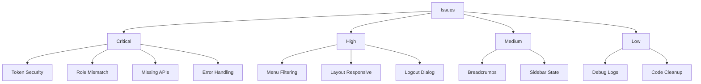
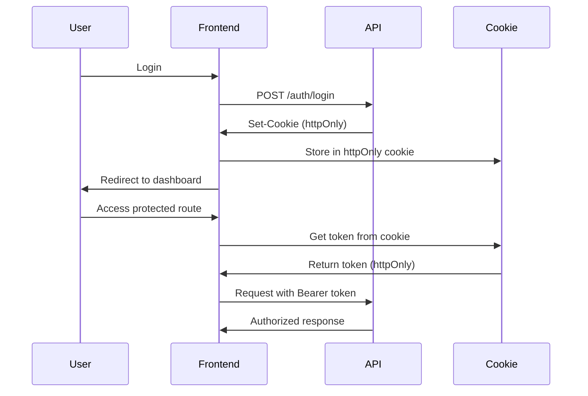

# Frontend Adjustment Plan - Detailed Technical Specification

## Document Overview

This document outlines a comprehensive plan to address critical issues identified in the frontend codebase. The plan prioritizes security vulnerabilities, API inconsistencies, and architectural improvements needed for a production-ready cinema management system.

**Project**: Cinema System Frontend  
**Module**: Web/cinema-ui  
**Last Updated**: 2026-03-06  
**Version**: 1.0

---

## Table of Contents

1. [Executive Summary](#executive-summary)
2. [Priority Matrix](#priority-matrix)
3. [Issue Details and Solutions](#issue-details-and-solutions)
   - [1. Authentication & Authorization (Critical)](#1-authentication--authorization-critical)
   - [2. API Endpoints (Critical)](#2-api-endpoints-critical)
   - [3. Routing & Layout (High)](#3-routing--layout-high)
   - [4. Pages & Data Fetching (Critical)](#4-pages--data-fetching-critical)
4. [Implementation Order](#implementation-order)
5. [File Modification Reference](#file-modification-reference)
6. [Mermaid Diagrams](#mermaid-diagrams)

---

## Executive Summary

The frontend codebase contains **4 critical categories** with **24+ identified issues** requiring immediate attention:

| Priority | Count | Risk Level                                                |
| -------- | ----- | --------------------------------------------------------- |
| Critical | 15    | Security vulnerabilities, data loss, broken functionality |
| High     | 6     | Poor user experience, maintainability issues              |
| Medium   | 3     | Minor UX improvements                                     |
| Low      | 2     | Code cleanup                                              |

**Key Findings:**

- **Security**: Token stored in localStorage (XSS vulnerable), no signature verification
- **API Mismatch**: Frontend allows Admin/Manager/Staff for admin routes, but backend only accepts Admin
- **Missing Endpoints**: 7+ backend controllers not integrated into frontend
- **Code Quality**: Direct API calls instead of React Query hooks, type safety issues

---

## Priority Matrix



---

## Issue Details and Solutions

### 1. AUTHENTICATION & AUTHORIZATION (Critical)

#### Issue 1.1: Token Stored in localStorage (XSS Vulnerability)

**Severity**: CRITICAL  
**Impact**: Tokens can be stolen via XSS attacks  
**Current State**: [`token.ts`](Web/cinema-ui/src/shared/utils/token.ts:47-48) uses `localStorage.setItem()`

**Solution**: Implement httpOnly cookie-based token storage

**Implementation Steps**:

1. Create cookie utility functions in [`shared/utils/cookie.ts`](Web/cinema-ui/src/shared/utils/cookie.ts):

   ```typescript
   // Set tokens in httpOnly cookies (server must handle)
   export function setTokensCookie(
     accessToken: string,
     refreshToken: string,
   ): void;
   export function getAccessTokenCookie(): string | null;
   export function getRefreshTokenCookie(): string | null;
   export function clearTokensCookie(): void;
   ```

2. Update [`authStore.ts`](Web/cinema-ui/src/features/auth/store/authStore.ts) to use cookies:
   - Remove localStorage persistence
   - Add cookie-based token retrieval

3. Modify [`axios.instance.ts`](Web/cinema-ui/src/shared/api/axios.instance.ts:52-57):
   - Retrieve token from cookies instead of localStorage

**Files to Modify**:

- `Web/cinema-ui/src/shared/utils/token.ts` - Add cookie support
- `Web/cinema-ui/src/shared/utils/cookie.ts` - New file
- `Web/cinema-ui/src/features/auth/store/authStore.ts` - Update persistence
- `Web/cinema-ui/src/shared/api/axios.instance.ts` - Update token retrieval

---

#### Issue 1.2: No Token Signature Verification

**Severity**: CRITICAL  
**Impact**: Invalid tokens accepted without validation  
**Current State**: [`token.ts`](Web/cinema-ui/src/shared/utils/token.ts:8-25) only decodes JWT, no verification

**Solution**: Add token signature verification or rely on API response validation

**Implementation Steps**:

1. Add validation flag option in token utilities
2. Implement token validation via API endpoint
3. Add token validation on app initialization

**Files to Modify**:

- `Web/cinema-ui/src/shared/utils/token.ts` - Add verification

---

#### Issue 1.3: Role Case-Sensitivity Inconsistency

**Severity**: CRITICAL  
**Impact**: Different role handling between ProtectedRoute and authRedirect  
**Current State**:

- [`ProtectedRoute.tsx`](Web/cinema-ui/src/shared/components/common/ProtectedRoute.tsx:35) uses case-sensitive comparison
- [`authRedirect.ts`](Web/cinema-ui/src/shared/utils/authRedirect.ts:16-18) uses case-insensitive comparison

**Solution**: Normalize role handling across all auth modules

**Implementation Steps**:

1. Update [`ProtectedRoute.tsx`](Web/cinema-ui/src/shared/components/common/ProtectedRoute.tsx:34-39):

   ```typescript
   const hasAllowedRole = user?.roles.some((role) =>
     allowedRoles.includes(role.toLowerCase()),
   );
   ```

2. Ensure consistent role format throughout:
   - Store roles as lowercase in auth store
   - Use normalized comparisons everywhere

**Files to Modify**:

- `Web/cinema-ui/src/shared/components/common/ProtectedRoute.tsx`

---

#### Issue 1.4: useRegister Hook Incomplete

**Severity**: CRITICAL  
**Impact**: No auto-login after registration, no error handling  
**Current State**: [`useRegister.ts`](Web/cinema-ui/src/features/auth/hooks/useRegister.ts:1-10) only wraps mutation

**Solution**: Complete the registration flow

**Implementation Steps**:

1. Enhance [`useRegister.ts`](Web/cinema-ui/src/features/auth/hooks/useRegister.ts):

   ```typescript
   export function useRegister() {
       const navigate = useNavigate();
       const setAuth = useAuthStore((state) => state.setAuth);

       return useMutation({
           mutationFn: (data: RegisterRequest) => authApi.register(data),
           onSuccess: async (response) => {
               // Auto-login after registration
               setTokens(response.accessToken, response.refreshToken);
               const userInfo = getUserFromToken(response.accessToken);
               if (userInfo) {
                   setAuth({...}, response.accessToken, response.refreshToken);
                   message.success('Đăng ký thành công!');
                   navigate('/');
               }
           },
           onError: (error: Error) => {
               message.error(error.message || 'Đăng ký thất bại');
           }
       });
   }
   ```

2. Add proper error handling and user feedback

**Files to Modify**:

- `Web/cinema-ui/src/features/auth/hooks/useRegister.ts`

---

#### Issue 1.5: Missing Token Refresh Mechanism

**Severity**: CRITICAL  
**Impact**: Users logged out when token expires  
**Current State**: Partial implementation in [`axios.instance.ts`](Web/cinema-ui/src/shared/api/axios.instance.ts:66-126)

**Solution**: Enhance token refresh with proper queue handling

**Implementation Steps**:

1. Review and enhance [`axios.instance.ts`](Web/cinema-ui/src/shared/api/axios.instance.ts:74-126):
   - Ensure refresh queue properly handles concurrent requests
   - Add refresh token rotation support
   - Add exponential backoff for failed refresh attempts

2. Add token refresh status to auth store

**Files to Modify**:

- `Web/cinema-ui/src/shared/api/axios.instance.ts`
- `Web/cinema-ui/src/features/auth/store/authStore.ts`

---

#### Issue 1.6: Debug Console Logs in Production

**Severity**: MEDIUM  
**Impact**: Sensitive information exposed in production  
**Current State**: Multiple console.log statements in [`token.ts`](Web/cinema-ui/src/shared/utils/token.ts:85-116), [`useLogin.ts`](Web/cinema-ui/src/features/auth/hooks/useLogin.ts:18-61)

**Solution**: Remove debug logs or use proper logging library

**Implementation Steps**:

1. Remove all console.log statements from:
   - [`token.ts`](Web/cinema-ui/src/shared/utils/token.ts)
   - [`useLogin.ts`](Web/cinema-ui/src/features/auth/hooks/useLogin.ts)
   - [`authRedirect.ts`](Web/cinema-ui/src/shared/utils/authRedirect.ts)
   - All API files

2. Add environment-based logging:
   ```typescript
   const isDev = import.meta.env.DEV;
   if (isDev) console.log("debug info");
   ```

**Files to Modify**:

- `Web/cinema-ui/src/shared/utils/token.ts`
- `Web/cinema-ui/src/features/auth/hooks/useLogin.ts`
- `Web/cinema-ui/src/shared/utils/authRedirect.ts`

---

#### Issue 1.7: RBAC Not Granular (Admin/Manager/Staff)

**Severity**: CRITICAL  
**Impact**: All staff roles get same access  
**Current State**: [`router/index.tsx`](Web/cinema-ui/src/app/router/index.tsx:70) allows Admin/Manager/Staff to all admin routes

**Solution**: Implement granular role-based route access

**Implementation Steps**:

1. Define route permissions in [`router/index.tsx`](Web/cinema-ui/src/app/router/index.tsx):

   ```typescript
   const routePermissions = {
     "/admin": ["Admin"],
     "/admin/movies": ["Admin"],
     "/admin/cinemas": ["Admin"],
     "/admin/users": ["Admin"],
     "/admin/showtimes": ["Admin", "Manager"],
     "/admin/bookings": ["Admin", "Manager", "Staff"],
   };
   ```

2. Create granular route guards per route

3. Separate Manager-specific routes from Admin routes

**Files to Modify**:

- `Web/cinema-ui/src/app/router/index.tsx`
- `Web/cinema-ui/src/shared/components/common/ProtectedRoute.tsx`

---

### 2. API ENDPOINTS (Critical)

#### Issue 2.1: Role Mismatch - Frontend vs Backend

**Severity**: CRITICAL  
**Impact**: Manager/Staff users cannot access admin endpoints  
**Current State**:

- Frontend ([`router/index.tsx`](Web/cinema-ui/src/app/router/index.tsx:70)) allows Admin/Manager/Staff
- Backend only accepts Admin role

**Solution**: Align frontend with backend role requirements

**Implementation Steps**:

1. Update route protection in [`router/index.tsx`](Web/cinema-ui/src/app/router/index.tsx):

   ```typescript
   // Dashboard - Admin only
   { path: '/admin', allowedRoles: ['Admin'] }
   // Movies - Admin only
   { path: '/admin/movies', allowedRoles: ['Admin'] }
   // Cinemas - Admin only
   { path: '/admin/cinemas', allowedRoles: ['Admin'] }
   // Users - Admin only
   { path: '/admin/users', allowedRoles: ['Admin'] }
   // Showtimes - Admin/Manager
   { path: '/admin/showtimes', allowedRoles: ['Admin', 'Manager'] }
   // Bookings - Admin/Manager/Staff
   { path: '/admin/bookings', allowedRoles: ['Admin', 'Manager', 'Staff'] }
   ```

2. Update menu visibility in [`AdminLayout.tsx`](Web/cinema-ui/src/shared/components/layout/AdminLayout.tsx:51-82)

**Files to Modify**:

- `Web/cinema-ui/src/app/router/index.tsx`
- `Web/cinema-ui/src/shared/components/layout/AdminLayout.tsx`

---

#### Issue 2.2: Missing Backend Endpoints

**Severity**: CRITICAL  
**Impact**: No UI for managing time slots, equipment, staff, roles, pricing  
**Current State**: Frontend missing 7+ controller integrations

**Missing Endpoints to Add**:

| Controller                  | Purpose                   | Files to Create                |
| --------------------------- | ------------------------- | ------------------------------ |
| AdminTimeSlotsController    | Manage time slots         | `features/admin/timeSlots/`    |
| AdminEquipmentController    | Manage cinema equipment   | `features/admin/equipment/`    |
| ManagerStaffController      | Manage staff schedules    | `features/manager/staff/`      |
| RoleController              | Manage roles              | `features/admin/roles/`        |
| AdminPricingTiersController | Manage pricing tiers      | `features/admin/pricingTiers/` |
| ManagerShiftsController     | Manage staff shifts       | `features/manager/shifts/`     |
| ManagerBookingsController   | Manager booking oversight | Already partial                |

**Implementation Steps**:

1. Add endpoints to [`endpoints.ts`](Web/cinema-ui/src/shared/api/endpoints.ts):

   ```typescript
   ADMIN_TIMESLOTS: {
       BASE: `${API_BASE_URL}/api/admin/time-slots`,
       // ...
   },
   ADMIN_EQUIPMENT: {
       BASE: `${API_BASE_URL}/api/admin/equipment`,
       // ...
   },
   MANAGER_STAFF: {
       BASE: `${API_BASE_URL}/api/manager/staff`,
       // ...
   },
   ROLES: {
       BASE: `${API_BASE_URL}/api/roles`,
       // ...
   },
   ADMIN_PRICING_TIERS: {
       BASE: `${API_BASE_URL}/api/admin/pricing-tiers`,
       // ...
   },
   MANAGER_SHIFTS: {
       BASE: `${API_BASE_URL}/api/manager/shifts`,
       // ...
   },
   ```

2. Create API client files for each feature
3. Create React Query hooks for each feature
4. Create admin pages for each feature

**Files to Create/Modify**:

- `Web/cinema-ui/src/shared/api/endpoints.ts` - Add endpoint definitions
- `Web/cinema-ui/src/features/admin/timeSlots/` - New directory
- `Web/cinema-ui/src/features/admin/equipment/` - New directory
- `Web/cinema-ui/src/features/manager/staff/` - New directory
- `Web/cinema-ui/src/features/admin/roles/` - New directory
- `Web/cinema-ui/src/features/admin/pricingTiers/` - New directory
- `Web/cinema-ui/src/features/manager/shifts/` - New directory

---

#### Issue 2.3: HTTP Error Handling Issues

**Severity**: CRITICAL  
**Impact**: Silent failures, poor user experience  
**Current State**:

- [`axios.instance.ts`](Web/cinema-ui/src/shared/api/axios.instance.ts:140) silences 400 errors
- Hard redirects without user feedback

**Solution**: Implement comprehensive error handling

**Implementation Steps**:

1. Update error handling in [`axios.instance.ts`](Web/cinema-ui/src/shared/api/axios.instance.ts:129-144):

   ```typescript
   // Handle different error types
   switch (error.response?.status) {
     case 400:
       // Show validation errors
       const validationErrors = error.response.data.errors;
       if (validationErrors) {
         Object.values(validationErrors).forEach((err) =>
           message.error(err[0]),
         );
       } else {
         message.error(errorMessage);
       }
       break;
     case 403:
       message.error("Bạn không có quyền thực hiện thao tác này");
       break;
     case 404:
       message.error("Không tìm thấy tài nguyên");
       break;
     case 500:
       message.error("Lỗi máy chủ, vui lòng thử lại sau");
       break;
     default:
       message.error(errorMessage);
   }
   ```

2. Remove silent error suppression

**Files to Modify**:

- `Web/cinema-ui/src/shared/api/axios.instance.ts`

---

#### Issue 2.4: Profile Endpoint Mismatch

**Severity**: HIGH  
**Impact**: Profile API inconsistency  
**Current State**: Multiple profile endpoints with different structures

**Solution**: Standardize profile API usage

**Implementation Steps**:

1. Review and consolidate profile endpoints in [`endpoints.ts`](Web/cinema-ui/src/shared/api/endpoints.ts:30-33)
2. Update profile API in [`profileApi.ts`](Web/cinema-ui/src/features/profile/api/profileApi.ts)

**Files to Modify**:

- `Web/cinema-ui/src/shared/api/endpoints.ts`
- `Web/cinema-ui/src/features/profile/api/profileApi.ts`

---

### 3. ROUTING & LAYOUT (High)

#### Issue 3.1: Menu Items Hardcoded - No Role-Based Filtering

**Severity**: HIGH  
**Impact**: All users see all menu items regardless of permissions  
**Current State**: [`AdminLayout.tsx`](Web/cinema-ui/src/shared/components/layout/AdminLayout.tsx:51-82) has static menu

**Solution**: Implement role-based menu filtering

**Implementation Steps**:

1. Update [`AdminLayout.tsx`](Web/cinema-ui/src/shared/components/layout/AdminLayout.tsx:51-82):

   ```typescript
   const menuItems = [
       { key: '/admin', icon: <DashboardOutlined />, label: <Link to="/admin">Dashboard</Link>, roles: ['Admin'] },
       { key: '/admin/movies', icon: <VideoCameraOutlined />, label: <Link to="/admin/movies">Quản lý phim</Link>, roles: ['Admin'] },
       { key: '/admin/cinemas', icon: <DesktopOutlined />, label: <Link to="/admin/cinemas">Quản lý rạp</Link>, roles: ['Admin'] },
       { key: '/admin/showtimes', icon: <CalendarOutlined />, label: <Link to="/admin/showtimes">Quản lý suất chiếu</Link>, roles: ['Admin', 'Manager'] },
       { key: '/admin/bookings', icon: <CalendarOutlined />, label: <Link to="/admin/bookings">Quản lý đặt vé</Link>, roles: ['Admin', 'Manager', 'Staff'] },
       { key: '/admin/users', icon: <UserOutlined />, label: <Link to="/admin/users">Quản lý người dùng</Link>, roles: ['Admin'] },
   ];

   const userRoles = user?.roles || [];
   const filteredMenuItems = menuItems.filter(item =>
       item.roles.some(role => userRoles.includes(role))
   );
   ```

**Files to Modify**:

- `Web/cinema-ui/src/shared/components/layout/AdminLayout.tsx`

---

#### Issue 3.2: AdminLayout Lacks Responsive Breakpoints

**Severity**: HIGH  
**Impact**: Poor mobile/tablet experience  
**Current State**: Fixed sidebar width, no responsive breakpoints

**Solution**: Add responsive design

**Implementation Steps**:

1. Update [`AdminLayout.tsx`](Web/cinema-ui/src/shared/components/layout/AdminLayout.tsx:84-149):

   ```typescript
   import { useMediaQuery } from "antd";

   const isMobile = useMediaQuery("(max-width: 768px)");
   const isTablet = useMediaQuery("(max-width: 1024px)");

   // Adjust layout based on screen size
   useEffect(() => {
     if (isMobile) setCollapsed(true);
   }, [isMobile]);
   ```

2. Add responsive CSS styles

**Files to Modify**:

- `Web/cinema-ui/src/shared/components/layout/AdminLayout.tsx`

---

#### Issue 3.3: No Breadcrumbs or Page Title Management

**Severity**: MEDIUM  
**Impact**: Poor navigation UX  
**Current State**: No breadcrumbs in admin layout

**Solution**: Add breadcrumb navigation

**Implementation Steps**:

1. Create Breadcrumb component
2. Integrate into AdminLayout
3. Add page title hook

**Files to Modify**:

- `Web/cinema-ui/src/shared/components/layout/AdminLayout.tsx`
- Create `Web/cinema-ui/src/shared/components/common/Breadcrumb.tsx`

---

#### Issue 3.4: Sidebar Collapse State Not Persisted

**Severity**: MEDIUM  
**Impact**: User preference lost on refresh  
**Current State**: [`AdminLayout.tsx`](Web/cinema-ui/src/shared/components/layout/AdminLayout.tsx:20) uses local state

**Solution**: Persist sidebar state

**Implementation Steps**:

1. Use localStorage or zustand persist for sidebar state:

   ```typescript
   const [collapsed, setCollapsed] = useState(() => {
     const saved = localStorage.getItem("sidebar_collapsed");
     return saved === "true";
   });

   useEffect(() => {
     localStorage.setItem("sidebar_collapsed", String(collapsed));
   }, [collapsed]);
   ```

**Files to Modify**:

- `Web/cinema-ui/src/shared/components/layout/AdminLayout.tsx`

---

#### Issue 3.5: No Global Layout Store

**Severity**: HIGH  
**Impact**: Inconsistent layout state across components

**Solution**: Create layout store

**Implementation Steps**:

1. Create layout store in [`features/layout/store/layoutStore.ts`](Web/cinema-ui/src/features/layout/store/layoutStore.ts):
   ```typescript
   interface LayoutStore {
     sidebarCollapsed: boolean;
     setSidebarCollapsed: (collapsed: boolean) => void;
     breadcrumbs: BreadcrumbItem[];
     setBreadcrumbs: (items: BreadcrumbItem[]) => void;
   }
   ```

**Files to Create**:

- `Web/cinema-ui/src/features/layout/store/layoutStore.ts`

---

#### Issue 3.6: No Logout Confirmation Dialog

**Severity**: MEDIUM  
**Impact**: Accidental logout possible  
**Current State**: [`AdminLayout.tsx`](Web/cinema-ui/src/shared/components/layout/AdminLayout.tsx:22-25) logs out immediately

**Solution**: Add confirmation modal

**Implementation Steps**:

1. Update [`AdminLayout.tsx`](Web/cinema-ui/src/shared/components/layout/AdminLayout.tsx:22-25):
   ```typescript
   const handleLogout = () => {
     Modal.confirm({
       title: "Đăng xuất",
       content: "Bạn có chắc chắn muốn đăng xuất?",
       onOk: () => {
         logout();
         navigate("/login");
       },
     });
   };
   ```

**Files to Modify**:

- `Web/cinema-ui/src/shared/components/layout/AdminLayout.tsx`

---

### 4. PAGES & DATA FETCHING (Critical)

#### Issue 4.1: Direct API Calls Instead of React Query Hooks

**Severity**: CRITICAL  
**Impact**: No caching, no error handling, no loading states  
**Current State**: [`admin/movies.tsx`](Web/cinema-ui/src/pages/admin/movies.tsx:31-41) uses direct `api.get()`

**Solution**: Refactor to use React Query hooks

**Implementation Steps**:

1. Add query hook for fetching movies in [`useAdminMovies.ts`](Web/cinema-ui/src/features/admin/movies/hooks/useAdminMovies.ts):

   ```typescript
   export const useAdminMovies = () => {
     return useQuery({
       queryKey: movieKeys.admin,
       queryFn: () => adminMoviesApi.getMovies(),
     });
   };
   ```

2. Refactor [`admin/movies.tsx`](Web/cinema-ui/src/pages/admin/movies.tsx):

   ```typescript
   const { data: movies, isLoading, error, refetch } = useAdminMovies();
   ```

3. Update API to include getMovies method

**Files to Modify**:

- `Web/cinema-ui/src/features/admin/movies/api/adminMoviesApi.ts`
- `Web/cinema-ui/src/features/admin/movies/hooks/useAdminMovies.ts`
- `Web/cinema-ui/src/pages/admin/movies.tsx`

---

#### Issue 4.2: No Error Handling in Multiple Pages

**Severity**: CRITICAL  
**Impact**: Silent failures confuse users  
**Current State**: Multiple pages lack proper error handling

**Solution**: Add consistent error handling

**Implementation Steps**:

1. Create error boundary component
2. Add error states to all pages:
   ```typescript
   if (isError) {
       return (
           <Result
               status="error"
               title="Lỗi tải dữ liệu"
               extra={<Button onClick={() => refetch()}>Thử lại</Button>}
           />
       );
   }
   ```

**Files to Modify** (all admin pages):

- `Web/cinema-ui/src/pages/admin/movies.tsx`
- `Web/cinema-ui/src/pages/admin/cinemas.tsx`
- `Web/cinema-ui/src/pages/admin/showtimes.tsx`
- `Web/cinema-ui/src/pages/admin/bookings.tsx`
- `Web/cinema-ui/src/pages/admin/users.tsx`
- `Web/cinema-ui/src/pages/admin/index.tsx`

---

#### Issue 4.3: Inconsistent Loading States

**Severity**: HIGH  
**Impact**: Poor user experience during data fetching

**Solution**: Standardize loading states

**Implementation Steps**:

1. Use consistent loading component:

   ```typescript
   {isLoading && <Skeleton active />}
   ```

2. Apply to all pages

**Files to Modify**:

- All admin pages

---

#### Issue 4.4: Type Safety Issues (Use of `any`)

**Severity**: CRITICAL  
**Impact**: Runtime errors, poor IDE support  
**Current State**: [`admin/movies.tsx`](Web/cinema-ui/src/pages/admin/movies.tsx:69) uses `any`

**Solution**: Add proper TypeScript types

**Implementation Steps**:

1. Replace `any` with proper types:

   ```typescript
   // Before
   const handleSubmit = async (values: any) => { ... }

   // After
   interface MovieFormValues {
       title: string;
       description?: string;
       genre: string;
       duration: number;
       releaseDate: string;
       posterUrl?: string;
       trailerUrl?: string;
   }
   const handleSubmit = async (values: MovieFormValues) => { ... }
   ```

2. Add proper interfaces for all forms

**Files to Modify**:

- `Web/cinema-ui/src/pages/admin/movies.tsx`
- All other admin pages

---

#### Issue 4.5: Missing Query Invalidation After Mutations

**Severity**: HIGH  
**Impact**: Stale data displayed after CRUD operations

**Solution**: Add proper query invalidation

**Implementation Steps**:

1. Update all mutation hooks in [`useAdminMovies.ts`](Web/cinema-ui/src/features/admin/movies/hooks/useAdminMovies.ts):
   ```typescript
   export const useCreateMovie = () => {
     const queryClient = useQueryClient();

     return useMutation({
       mutationFn: (data: CreateMovieRequest) =>
         adminMoviesApi.createMovie(data),
       onSuccess: () => {
         queryClient.invalidateQueries({ queryKey: ["admin-movies"] });
         message.success("Tạo phim thành công");
       },
       onError: () => {
         message.error("Tạo phim thất bại");
       },
     });
   };
   ```

**Files to Modify**:

- All admin feature hooks

---

#### Issue 4.6: Unsafe Null Assertions

**Severity**: HIGH  
**Impact**: Potential runtime crashes

**Solution**: Add proper null checks

**Implementation Steps**:

1. Replace assertions with proper checks:

   ```typescript
   // Before
   <span>{user!.username}</span>

   // After
   <span>{user?.username || 'Guest'}</span>
   ```

**Files to Modify**:

- All pages with null assertions

---

#### Issue 4.7: Array Indices as Keys

**Severity**: LOW  
**Impact**: Rendering issues with dynamic lists

**Solution**: Use proper unique keys

**Implementation Steps**:

1. Replace index keys with unique identifiers:

   ```typescript
   // Before
   {items.map((item, index) => <Item key={index} />)}

   // After
   {items.map((item) => <Item key={item.id} />)}
   ```

**Files to Modify**:

- All list rendering pages

---

## Implementation Order

```mermaid
flowchart LR
    subgraph Phase1["Phase 1: Critical Security & API"]
        A1[Fix Token Storage]
        A2[Fix Role Case Sensitivity]
        A3[Fix Role Mismatch]
        A4[Add Missing APIs]
    end

    subgraph Phase2["Phase 2: Core Refactoring"]
        B1[Use React Query Hooks]
        B2[Add Error Handling]
        B3[Type Safety Fixes]
    end

    subgraph Phase3["Phase 3: UX Improvements"]
        C1[Role-based Menu]
        C3[Responsive Layout]
        C4[Logout Confirm]
    end

    subgraph Phase4["Phase 4: Polish"]
        D1[Remove Debug Logs]
        D2[Breadcrumbs]
        D3[Sidebar Persistence]
    end

    A1 --> A2 --> A3 --> A4 --> B1 --> B2 --> B3 --> C1 --> C3 --> C4 --> D1 --> D2 --> D3
```



### Phase 1: Critical Security & API (Week 1-2)

1. **Token Security Fix** - Implement httpOnly cookie storage
2. **Role Case Sensitivity** - Normalize role handling
3. **Role Route Mismatch** - Align frontend with backend
4. **Missing Endpoints** - Add all 7+ missing API integrations

### Phase 2: Core Refactoring (Week 2-3)

1. **React Query Migration** - Convert direct API calls to hooks
2. **Error Handling** - Add comprehensive error states
3. **Type Safety** - Remove `any` types, add proper interfaces

### Phase 3: UX Improvements (Week 3-4)

1. **Role-based Menu** - Filter menu by permissions
2. **Responsive Layout** - Add mobile/tablet support
3. **Logout Confirmation** - Prevent accidental logout

### Phase 4: Polish (Week 4)

1. **Debug Logs** - Remove console statements
2. **Breadcrumbs** - Add navigation
3. **Sidebar State** - Persist user preference

---

## File Modification Reference

### Authentication & Authorization

| File                                                            | Action                      | Priority |
| --------------------------------------------------------------- | --------------------------- | -------- |
| `Web/cinema-ui/src/shared/utils/token.ts`                       | Modify - Add cookie support | Critical |
| `Web/cinema-ui/src/shared/utils/cookie.ts`                      | Create - Cookie utilities   | Critical |
| `Web/cinema-ui/src/features/auth/store/authStore.ts`            | Modify - Update persistence | Critical |
| `Web/cinema-ui/src/shared/api/axios.instance.ts`                | Modify - Token retrieval    | Critical |
| `Web/cinema-ui/src/shared/components/common/ProtectedRoute.tsx` | Modify - Role handling      | Critical |
| `Web/cinema-ui/src/features/auth/hooks/useRegister.ts`          | Modify - Complete flow      | Critical |
| `Web/cinema-ui/src/shared/utils/authRedirect.ts`                | Modify - Remove debug logs  | Medium   |

### API Endpoints

| File                                                   | Action                    | Priority |
| ------------------------------------------------------ | ------------------------- | -------- |
| `Web/cinema-ui/src/shared/api/endpoints.ts`            | Modify - Add 7+ endpoints | Critical |
| `Web/cinema-ui/src/shared/api/axios.instance.ts`       | Modify - Error handling   | Critical |
| `features/admin/timeSlots/api/timeSlotsApi.ts`         | Create                    | Critical |
| `features/admin/timeSlots/hooks/useTimeSlots.ts`       | Create                    | Critical |
| `features/admin/equipment/api/equipmentApi.ts`         | Create                    | Critical |
| `features/admin/equipment/hooks/useEquipment.ts`       | Create                    | Critical |
| `features/manager/staff/api/staffApi.ts`               | Create                    | Critical |
| `features/manager/staff/hooks/useStaff.ts`             | Create                    | Critical |
| `features/admin/roles/api/rolesApi.ts`                 | Create                    | Critical |
| `features/admin/roles/hooks/useRoles.ts`               | Create                    | Critical |
| `features/admin/pricingTiers/api/pricingTiersApi.ts`   | Create                    | Critical |
| `features/admin/pricingTiers/hooks/usePricingTiers.ts` | Create                    | Critical |
| `features/manager/shifts/api/shiftsApi.ts`             | Create                    | Critical |
| `features/manager/shifts/hooks/useShifts.ts`           | Create                    | Critical |

### Routing & Layout

| File                                                         | Action                         | Priority |
| ------------------------------------------------------------ | ------------------------------ | -------- |
| `Web/cinema-ui/src/app/router/index.tsx`                     | Modify - Granular RBAC         | Critical |
| `Web/cinema-ui/src/shared/components/layout/AdminLayout.tsx` | Modify - Multiple improvements | High     |
| `Web/cinema-ui/src/features/layout/store/layoutStore.ts`     | Create                         | High     |
| `Web/cinema-ui/src/shared/components/common/Breadcrumb.tsx`  | Create                         | Medium   |

### Pages & Data Fetching

| File                                                              | Action                   | Priority |
| ----------------------------------------------------------------- | ------------------------ | -------- |
| `Web/cinema-ui/src/pages/admin/movies.tsx`                        | Modify - Use React Query | Critical |
| `Web/cinema-ui/src/features/admin/movies/api/adminMoviesApi.ts`   | Modify - Add queries     | Critical |
| `Web/cinema-ui/src/features/admin/movies/hooks/useAdminMovies.ts` | Modify - Add queries     | Critical |
| `Web/cinema-ui/src/pages/admin/cinemas.tsx`                       | Modify - Use React Query | Critical |
| `Web/cinema-ui/src/pages/admin/showtimes.tsx`                     | Modify - Use React Query | Critical |
| `Web/cinema-ui/src/pages/admin/bookings.tsx`                      | Modify - Use React Query | Critical |
| `Web/cinema-ui/src/pages/admin/users.tsx`                         | Modify - Use React Query | Critical |
| `Web/cinema-ui/src/pages/admin/index.tsx`                         | Modify - Use React Query | Critical |

---

## Mermaid Diagrams

### Authentication Flow After Fix



### Role-Based Access Control

```mermaid
flowchart TD
    A[User Login] --> B{Get User Roles}
    B --> C[Admin]
    B --> D[Manager]
    B --> E[Staff]
    B --> F[Customer]

    C --> C1[Full Admin Access]
    D --> D1[Limited Admin Access]
    E --> E1[Bookings Only]
    F --> F1[Customer Portal]

    C1 --> G[Allowed Routes]
    D1 --> G
    E1 --> G
    F1 --> H[Customer Routes]

    G --> I[/admin, /admin/showtimes, /admin/bookings]
    H --> J[/, /movies, /booking, /profile]
```

---

## Conclusion

This plan addresses **24+ critical and high-priority issues** across authentication, API integration, routing, and data fetching. Implementation should follow the phased approach to minimize risk and ensure stable deliveries.

**Total Files to Modify**: 35+  
**Total Files to Create**: 15+  
**Estimated Phases**: 4

---

_Document generated as part of Cinema System Frontend Analysis_
