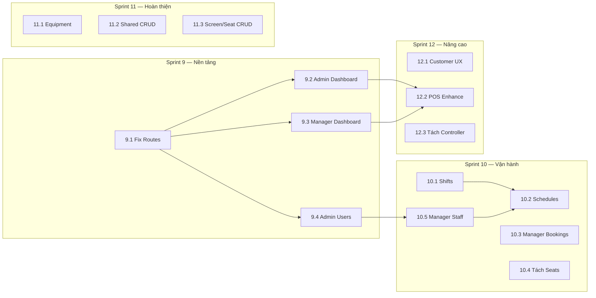

# 🎬 Cinema System — Kế Hoạch Triển Khai API (Task Plan)

> **Ngày tạo:** 2026-03-04  
> **Tham chiếu:** [overview_plans.md](file:///d:/DACS4/cinemaSystem/plans/overview_plans.md)  
> **Phương pháp:** Agile Sprints — chia theo nghiệp vụ doanh nghiệp, ưu tiên theo giá trị kinh doanh.

---

## Tổng Quan Kế Hoạch

```
┌─────────────────────────────────────────────────────────────────────┐
│  SPRINT 9  │ Nền tảng — Fix Convention + Dashboard + Quản lý Users │
│  SPRINT 10 │ Vận hành — Ca làm + Booking rạp + Seats tách role     │
│  SPRINT 11 │ Hoàn thiện — Equipment + Shared CRUD + Screen/Seat    │
│  SPRINT 12 │ Nâng cao — Customer UX + POS enhancements + Tách ctrl │
└─────────────────────────────────────────────────────────────────────┘
```

---

## 🔴 SPRINT 9 — Nền Tảng Quản Trị & Báo Cáo

> **Mục tiêu kinh doanh:** Ban lãnh đạo cần xem được doanh thu, thống kê. Admin cần quản lý users. Route API phải chuẩn convention cho FE team.  
> **Ước lượng:** 5–7 ngày làm việc

---

### Task 9.1: Fix Route Convention cho Controllers hiện tại

**Giá trị:** FE team không bị lẫn lộn route pattern, chuẩn hóa toàn bộ API.

| #     | Việc cần làm                        | File/Controller                                   | Chi tiết                                    |
| ----- | ----------------------------------- | ------------------------------------------------- | ------------------------------------------- |
| 9.1.1 | Thêm `[Route("api/admin/cinemas")]` | `AdminCinemasController.cs`                       | Hiện đang auto-gen `api/AdminCinemas`       |
| 9.1.2 | Thêm `[Route("api/admin/movies")]`  | `AdminMoviesController.cs`                        | Hiện đang auto-gen `api/AdminMovies`        |
| 9.1.3 | Đổi route thành `api/admin/roles`   | `RoleController.cs`                               | Hiện là `api/Role` (singular, thiếu prefix) |
| 9.1.4 | Thêm `[Authorize(Roles = "Admin")]` | `AdminCinemasController`, `AdminMoviesController` | Đảm bảo phân quyền đúng                     |
| 9.1.5 | Cập nhật Swagger documentation      | Tất cả controllers đã fix                         | Verify trên Swagger UI                      |

**Acceptance Criteria:**

- [ ] Tất cả Admin controllers có route prefix `api/admin/...`
- [ ] Swagger hiển thị đúng route mới
- [ ] FE có thể gọi API đúng route mới

---

### Task 9.2: Admin Dashboard & Báo Cáo Doanh Thu

**Giá trị:** Giám đốc/Admin xem được tình hình kinh doanh toàn chuỗi rạp — doanh thu, lượng vé, phim ăn khách.

| #     | Việc cần làm                      | Layer       | Chi tiết                                            |
| ----- | --------------------------------- | ----------- | --------------------------------------------------- |
| 9.2.1 | Tạo `AdminDashboardController`    | API         | Route: `api/admin/dashboard`, Authorize: Admin      |
| 9.2.2 | Implement `GetRevenueQuery`       | Application | Doanh thu theo ngày/tuần/tháng, filter theo cinema  |
| 9.2.3 | Implement `GetSystemStatsQuery`   | Application | Tổng cinemas, movies, bookings, users, revenue      |
| 9.2.4 | Implement `GetTopMoviesQuery`     | Application | Top 10 phim ăn khách (theo doanh thu hoặc lượng vé) |
| 9.2.5 | Implement `GetOccupancyRateQuery` | Application | Tỉ lệ lấp đầy ghế theo cinema/screen/ngày           |

**API Endpoints:**

```
GET api/admin/dashboard/revenue?from=&to=&cinemaId=&groupBy=day|week|month
GET api/admin/dashboard/stats
GET api/admin/dashboard/top-movies?limit=10&from=&to=
GET api/admin/dashboard/occupancy-rate?cinemaId=&from=&to=
```

**Acceptance Criteria:**

- [ ] Admin xem được tổng doanh thu chuỗi rạp theo khoảng thời gian
- [ ] Admin xem được số lượng booking/phim/rạp đang hoạt động
- [ ] Admin xem được bảng xếp hạng phim ăn khách
- [ ] Admin xem được tỉ lệ lấp đầy phòng chiếu

---

### Task 9.3: Manager Dashboard & Báo Cáo Rạp

**Giá trị:** Quản lý rạp xem được tình hình kinh doanh rạp mình — hỗ trợ ra quyết định điều phối nhân sự, lịch chiếu.

| #     | Việc cần làm                      | Layer       | Chi tiết                                               |
| ----- | --------------------------------- | ----------- | ------------------------------------------------------ |
| 9.3.1 | Tạo `ManagerDashboardController`  | API         | Route: `api/manager/dashboard`, lấy cinemaId từ token  |
| 9.3.2 | Implement `GetCinemaRevenueQuery` | Application | Doanh thu rạp đang quản lý                             |
| 9.3.3 | Implement `GetCinemaStatsQuery`   | Application | Booking hôm nay, doanh thu hôm nay, suất chiếu sắp tới |
| 9.3.4 | Implement `GetDailyReportQuery`   | Application | Báo cáo cuối ngày (vé bán, bắp nước, hủy, hoàn)        |

**API Endpoints:**

```
GET api/manager/dashboard/revenue?from=&to=&groupBy=day|week|month
GET api/manager/dashboard/stats
GET api/manager/dashboard/daily-report?date=
```

**Acceptance Criteria:**

- [ ] Manager chỉ xem được dữ liệu rạp mình quản lý (không xem rạp khác)
- [ ] Stats hiển thị: bookings hôm nay, doanh thu hôm nay, suất chiếu còn lại
- [ ] Báo cáo cuối ngày tổng hợp: vé bán online + quầy, bắp nước, hủy, hoàn tiền

---

### Task 9.4: Quản Lý Users (Admin)

**Giá trị:** Admin cần xem/khóa/mở khóa tài khoản người dùng — bảo mật & chăm sóc khách hàng.

| #     | Việc cần làm                                                      | Layer       | Chi tiết                                      |
| ----- | ----------------------------------------------------------------- | ----------- | --------------------------------------------- |
| 9.4.1 | Tạo `AdminUsersController`                                        | API         | Route: `api/admin/users`                      |
| 9.4.2 | Implement `GetAllUsersQuery`                                      | Application | Paged list, filter by role/status/keyword     |
| 9.4.3 | Implement `GetUserDetailQuery`                                    | Application | Chi tiết user + booking history tóm tắt       |
| 9.4.4 | Implement `LockUserCommand`                                       | Application | Khóa/mở khóa tài khoản                        |
| 9.4.5 | Implement `GetStaffListQuery`                                     | Application | Danh sách staff + cinema assignment           |
| 9.4.6 | Di chuyển `CreateStaff`, `UpdateUserRole` từ `IdentityController` | Refactor    | Về `AdminUsersController` cho đúng phân quyền |

**API Endpoints:**

```
GET  api/admin/users?page=&pageSize=&role=&status=&search=
GET  api/admin/users/{id}
PUT  api/admin/users/{id}/status        (lock/unlock)
GET  api/admin/users/staff
POST api/admin/users/staff              (tạo staff — chuyển từ Identity)
PUT  api/admin/users/{id}/role          (chuyển từ Identity)
```

**Acceptance Criteria:**

- [ ] Admin xem được danh sách tất cả users (phân trang, lọc theo role)
- [ ] Admin khóa/mở khóa tài khoản user
- [ ] Admin tạo staff account (chuyển logic từ IdentityController)
- [ ] Kiểm tra phân quyền: chỉ Admin mới truy cập được

---

## 🟡 SPRINT 10 — Vận Hành Rạp

> **Mục tiêu kinh doanh:** Manager vận hành rạp mượt mà — quản lý ca làm nhân viên, theo dõi booking tại rạp, duyệt hoàn tiền. Tách rõ trách nhiệm seat management.  
> **Ước lượng:** 5–7 ngày làm việc

---

### Task 10.1: Quản Lý Ca Làm (Shifts)

**Giá trị:** Manager cần xếp ca cho nhân viên — nền tảng cho quản lý nhân sự tại rạp.

> **Lưu ý:** Domain entities `Shift` và `WorkSchedule` đã có sẵn, đã có method `UpdateShift()`. Chỉ cần implement Application + API layer.

| #      | Việc cần làm                              | Layer                  | Chi tiết                                             |
| ------ | ----------------------------------------- | ---------------------- | ---------------------------------------------------- |
| 10.1.1 | Tạo `IShiftRepository`                    | Application/Interfaces | Interface cho Shift repository                       |
| 10.1.2 | Implement `ShiftRepository`               | Infrastructure         | EF Core repository cho Shift                         |
| 10.1.3 | Tạo `ManagerShiftsController`             | API                    | Route: `api/manager/shifts`                          |
| 10.1.4 | Implement `CreateShiftCommand`            | Application            | Tạo ca làm (name, start, end, cinemaId)              |
| 10.1.5 | Implement `UpdateShiftCommand`            | Application            | Cập nhật ca (dùng domain method `UpdateShift`)       |
| 10.1.6 | Implement `DeleteShiftCommand`            | Application            | Xóa mềm ca làm (check không có schedule đang active) |
| 10.1.7 | Implement `GetShiftsQuery`                | Application            | Danh sách ca theo cinema                             |
| 10.1.8 | Tạo DTOs: `ShiftRequest`, `ShiftResponse` | Shared/Models          | Request/Response models                              |

**API Endpoints:**

```
GET    api/manager/shifts?cinemaId=
POST   api/manager/shifts
PUT    api/manager/shifts/{id}
DELETE api/manager/shifts/{id}
```

**Acceptance Criteria:**

- [ ] Manager tạo được ca làm: "Ca Sáng 08:00–14:00", "Ca Chiều 14:00–22:00"
- [ ] Manager cập nhật được giờ bắt đầu/kết thúc ca
- [ ] Không xóa được ca đang có nhân viên xếp lịch
- [ ] Chỉ xem được ca tại rạp mình quản lý

---

### Task 10.2: Lịch Làm Nhân Viên (Work Schedules)

**Giá trị:** Manager xếp lịch làm theo tuần cho nhân viên — biết ai làm ca nào, ngày nào.

| #      | Việc cần làm                          | Layer                  | Chi tiết                                          |
| ------ | ------------------------------------- | ---------------------- | ------------------------------------------------- |
| 10.2.1 | Tạo `IWorkScheduleRepository`         | Application/Interfaces | Interface                                         |
| 10.2.2 | Implement `WorkScheduleRepository`    | Infrastructure         | EF Core repository                                |
| 10.2.3 | Tạo `ManagerSchedulesController`      | API                    | Route: `api/manager/schedules`                    |
| 10.2.4 | Implement `CreateScheduleCommand`     | Application            | Xếp nhân viên vào ca (staffId, shiftId, workDate) |
| 10.2.5 | Implement `BulkCreateScheduleCommand` | Application            | Xếp lịch cả tuần 1 lần                            |
| 10.2.6 | Implement `UpdateScheduleCommand`     | Application            | Đổi ca cho nhân viên                              |
| 10.2.7 | Implement `GetWeeklyScheduleQuery`    | Application            | Lịch làm theo tuần (bảng: staff x ngày)           |
| 10.2.8 | Implement `DeleteScheduleCommand`     | Application            | Hủy lịch đã xếp                                   |

**API Endpoints:**

```
GET    api/manager/schedules?cinemaId=&weekOf=&staffId=
POST   api/manager/schedules
POST   api/manager/schedules/bulk
PUT    api/manager/schedules/{id}
DELETE api/manager/schedules/{id}
```

**Acceptance Criteria:**

- [ ] Manager xếp được "Nhân viên A → Ca Sáng, Thứ 2–6"
- [ ] Manager xem được bảng lịch tuần (ai làm ca nào)
- [ ] Validate: không xếp 1 nhân viên 2 ca cùng ngày
- [ ] Bulk create: xếp cả tuần 1 lần cho nhiều nhân viên

---

### Task 10.3: Manager Quản Lý Booking Tại Rạp

**Giá trị:** Manager theo dõi booking tại rạp, duyệt yêu cầu hoàn tiền — quan trọng cho dịch vụ khách hàng.

| #      | Việc cần làm                       | Layer       | Chi tiết                                                 |
| ------ | ---------------------------------- | ----------- | -------------------------------------------------------- |
| 10.3.1 | Tạo `ManagerBookingsController`    | API         | Route: `api/manager/bookings`                            |
| 10.3.2 | Implement `GetCinemaBookingsQuery` | Application | Booking tại rạp (paged, filter status/date)              |
| 10.3.3 | Implement `GetTodayBookingsQuery`  | Application | Booking hôm nay (cho overview nhanh)                     |
| 10.3.4 | Implement `GetRefundRequestsQuery` | Application | Danh sách yêu cầu hoàn tiền chờ duyệt                    |
| 10.3.5 | Di chuyển `ApproveRefund` endpoint | Refactor    | Từ `BookingsController` sang `ManagerBookingsController` |

**API Endpoints:**

```
GET  api/manager/bookings?cinemaId=&status=&date=&page=&pageSize=
GET  api/manager/bookings/today
GET  api/manager/bookings/refund-requests
POST api/manager/bookings/{id}/approve-refund
```

**Acceptance Criteria:**

- [ ] Manager xem được tất cả booking tại rạp mình (lọc theo ngày, trạng thái)
- [ ] Manager xem nhanh booking hôm nay
- [ ] Manager duyệt/từ chối yêu cầu hoàn tiền
- [ ] Không xem được booking rạp khác

---

### Task 10.4: Tách Seat Management sang Manager

**Giá trị:** Tách rõ trách nhiệm — Block/Link/Unlink ghế là nghiệp vụ quản lý, không phải public API.

| #      | Việc cần làm                                 | Layer    | Chi tiết                                             |
| ------ | -------------------------------------------- | -------- | ---------------------------------------------------- |
| 10.4.1 | Tạo `ManagerSeatsController`                 | API      | Route: `api/manager/seats`                           |
| 10.4.2 | Di chuyển BlockSeat, LinkSeat, UnlinkSeat    | Refactor | Từ `CinemasController` sang `ManagerSeatsController` |
| 10.4.3 | Thêm `[Authorize(Roles = "Manager,Admin")]`  | API      | Phân quyền đúng                                      |
| 10.4.4 | Giữ `CinemasController` chỉ còn `GetCinemas` | Refactor | Public API only                                      |

**Acceptance Criteria:**

- [ ] `CinemasController` chỉ còn `GET api/cinemas` (public)
- [ ] Block/Link/Unlink seat nằm ở `api/manager/seats/...`
- [ ] Phân quyền: chỉ Manager + Admin mới truy cập được

---

### Task 10.5: Manager Xem Nhân Viên Tại Rạp

**Giá trị:** Manager cần biết nhân viên nào thuộc rạp mình để xếp ca, phân công.

| #      | Việc cần làm                      | Layer       | Chi tiết                                       |
| ------ | --------------------------------- | ----------- | ---------------------------------------------- |
| 10.5.1 | Tạo `ManagerStaffController`      | API         | Route: `api/manager/staff`                     |
| 10.5.2 | Implement `GetStaffByCinemaQuery` | Application | Danh sách staff thuộc cinema (paged)           |
| 10.5.3 | Implement `GetStaffDetailQuery`   | Application | Chi tiết staff (thông tin + lịch làm gần nhất) |

**API Endpoints:**

```
GET api/manager/staff?cinemaId=&page=&pageSize=
GET api/manager/staff/{id}
```

**Acceptance Criteria:**

- [ ] Manager xem được danh sách nhân viên thuộc rạp mình
- [ ] Xem chi tiết nhân viên bao gồm lịch làm gần nhất

---

## 🟢 SPRINT 11 — Hoàn Thiện Quản Trị

> **Mục tiêu kinh doanh:** Admin có full quyền CRUD cho tất cả danh mục gốc. Equipment management cho vận hành kỹ thuật.  
> **Ước lượng:** 4–5 ngày làm việc

---

### Task 11.1: Equipment Management

**Giá trị:** Quản lý thiết bị rạp (máy chiếu, âm thanh...) + lịch sử bảo trì — giảm rủi ro sự cố kỹ thuật.

> **Lưu ý:** Domain entities `Equipment`, `MaintenanceLog` đã có sẵn.

| #      | Việc cần làm                                            | Layer          | Chi tiết                                               |
| ------ | ------------------------------------------------------- | -------------- | ------------------------------------------------------ |
| 11.1.1 | Tạo `IEquipmentRepository`, `IMaintenanceLogRepository` | Application    | Interfaces                                             |
| 11.1.2 | Implement repositories                                  | Infrastructure | EF Core                                                |
| 11.1.3 | Tạo `AdminEquipmentController`                          | API            | Route: `api/admin/equipment`                           |
| 11.1.4 | Implement CRUD: Create, Update, GetAll, GetById         | Application    | Commands + Queries                                     |
| 11.1.5 | Tạo `ManagerEquipmentController`                        | API            | Route: `api/manager/equipment`                         |
| 11.1.6 | Implement `CreateMaintenanceLogCommand`                 | Application    | Ghi nhận bảo trì                                       |
| 11.1.7 | Implement `GetMaintenanceLogsQuery`                     | Application    | Lịch sử bảo trì theo thiết bị                          |
| 11.1.8 | Tạo DTOs                                                | Shared         | EquipmentRequest, EquipmentResponse, MaintenanceLogDto |

**API Endpoints:**

```
# Admin
POST   api/admin/equipment
PUT    api/admin/equipment/{id}
GET    api/admin/equipment?cinemaId=&status=
GET    api/admin/equipment/{id}

# Manager
GET    api/manager/equipment?status=
POST   api/manager/equipment/{id}/maintenance
GET    api/manager/equipment/{id}/maintenance-logs
```

**Acceptance Criteria:**

- [ ] Admin thêm/sửa thiết bị (tên, loại, rạp, phòng, trạng thái)
- [ ] Manager ghi nhận bảo trì (mô tả, chi phí, ngày)
- [ ] Manager xem lịch sử bảo trì thiết bị tại rạp mình

---

### Task 11.2: CRUD Đầy Đủ cho Shared Resources

**Giá trị:** Admin quản lý hoàn chỉnh danh mục gốc — bảng giá, khung giờ, thể loại, loại ghế.

| #      | Việc cần làm                                  | Layer       | Chi tiết                                   |
| ------ | --------------------------------------------- | ----------- | ------------------------------------------ |
| 11.2.1 | Tạo `AdminPricingTiersController`             | API         | Route: `api/admin/pricing-tiers`           |
| 11.2.2 | Implement CUD cho PricingTier                 | Application | Create, Update, Delete commands            |
| 11.2.3 | Tạo `AdminTimeSlotsController`                | API         | Route: `api/admin/time-slots`              |
| 11.2.4 | Implement CUD cho TimeSlot                    | Application | Create, Update, Delete commands            |
| 11.2.5 | Thêm `DeleteGenreCommand`                     | Application | Xóa mềm genre                              |
| 11.2.6 | Thêm `DeleteSeatTypeCommand`                  | Application | Xóa mềm seat type                          |
| 11.2.7 | Tách admin endpoints từ `GenresController`    | Refactor    | Create/Update → `AdminGenresController`    |
| 11.2.8 | Tách admin endpoints từ `SeatTypesController` | Refactor    | Create/Update → `AdminSeatTypesController` |

**API Endpoints:**

```
# Pricing Tiers (Admin)
POST   api/admin/pricing-tiers
PUT    api/admin/pricing-tiers/{id}
DELETE api/admin/pricing-tiers/{id}

# Time Slots (Admin)
POST   api/admin/time-slots
PUT    api/admin/time-slots/{id}
DELETE api/admin/time-slots/{id}

# Genres (Admin) — tách từ GenresController
POST   api/admin/genres
PUT    api/admin/genres/{id}
DELETE api/admin/genres/{id}

# Seat Types (Admin) — tách từ SeatTypesController
POST   api/admin/seat-types
PUT    api/admin/seat-types/{id}
DELETE api/admin/seat-types/{id}
```

**Acceptance Criteria:**

- [ ] Admin CRUD đầy đủ cho PricingTier, TimeSlot
- [ ] Admin xóa được Genre, SeatType (soft delete — check dependency)
- [ ] `GenresController` và `SeatTypesController` chỉ còn `GET` (public)
- [ ] Không xóa được nếu đang có dữ liệu phụ thuộc (ví dụ: xóa genre đang gắn phim)

---

### Task 11.3: Screen & Seat CRUD Đầy Đủ

**Giá trị:** Admin quản lý đầy đủ phòng chiếu và ghế — hỗ trợ mở rộng/thu hẹp phòng.

| #      | Việc cần làm                                | Layer       | Chi tiết                                    |
| ------ | ------------------------------------------- | ----------- | ------------------------------------------- |
| 11.3.1 | Implement `GetScreensQuery`                 | Application | Danh sách phòng chiếu theo cinema           |
| 11.3.2 | Implement `UpdateScreenCommand`             | Application | Cập nhật tên, loại, capacity                |
| 11.3.3 | Implement `DeleteScreenCommand`             | Application | Xóa mềm (check không có showtime active)    |
| 11.3.4 | Implement `UpdateSeatCommand`               | Application | Cập nhật loại ghế, trạng thái               |
| 11.3.5 | Implement `DeleteSeatCommand`               | Application | Xóa ghế                                     |
| 11.3.6 | Thêm endpoints vào `AdminCinemasController` | API         | Bổ sung GET/PUT/DELETE cho screens và seats |

**API Endpoints:**

```
GET    api/admin/cinemas/{cinemaId}/screens
PUT    api/admin/cinemas/{cinemaId}/screens/{screenId}
DELETE api/admin/cinemas/{cinemaId}/screens/{screenId}
PUT    api/admin/cinemas/screens/{screenId}/seats/{seatId}
DELETE api/admin/cinemas/screens/{screenId}/seats/{seatId}
```

**Acceptance Criteria:**

- [ ] Admin xem danh sách phòng chiếu theo rạp
- [ ] Admin cập nhật thông tin phòng chiếu
- [ ] Không xóa được phòng đang có lịch chiếu active
- [ ] Admin cập nhật/xóa ghế riêng lẻ

---

## 🔵 SPRINT 12 — Nâng Cao Trải Nghiệm

> **Mục tiêu kinh doanh:** Cải thiện trải nghiệm khách hàng, tăng hiệu suất POS, tách controller cho clean architecture.  
> **Ước lượng:** 4–5 ngày làm việc

---

### Task 12.1: Customer Enhancements

**Giá trị:** Khách hàng tìm phim dễ hơn, quản lý tài khoản tốt hơn.

| #      | Việc cần làm                                      | Layer       | Chi tiết                                      |
| ------ | ------------------------------------------------- | ----------- | --------------------------------------------- |
| 12.1.1 | Implement `POST api/auth/logout`                  | Auth        | Invalidate refresh token                      |
| 12.1.2 | Implement `GET api/movies/now-showing`            | Application | Phim đang chiếu (có showtime trong tương lai) |
| 12.1.3 | Implement `GET api/movies/coming-soon`            | Application | Phim sắp chiếu (status = ComingSoon)          |
| 12.1.4 | Implement `GET api/cinemas/{id}`                  | Application | Chi tiết rạp (địa chỉ, screens, tiện ích)     |
| 12.1.5 | Tạo `ProfileController`                           | API         | Tách profile APIs từ IdentityController       |
| 12.1.6 | `IdentityController` chỉ giữ OTP + reset password | Refactor    | Public APIs only                              |

**API Endpoints:**

```
POST api/auth/logout
GET  api/movies/now-showing
GET  api/movies/coming-soon
GET  api/cinemas/{id}
GET  api/profile                     (từ token)
PUT  api/profile                     (từ token)
POST api/profile/change-password     (từ token)
```

**Acceptance Criteria:**

- [ ] Customer đăng xuất, refresh token bị invalidate
- [ ] Phân biệt rõ phim đang chiếu vs sắp chiếu
- [ ] Profile API lấy userId từ token (không cần truyền userId trong URL)

---

### Task 12.2: POS Enhancements

**Giá trị:** Nhân viên quầy làm việc hiệu quả hơn — xem lịch hôm nay, in vé, tổng kết ca.

| #      | Việc cần làm                                | Layer       | Chi tiết                                                 |
| ------ | ------------------------------------------- | ----------- | -------------------------------------------------------- |
| 12.2.1 | Implement `GET api/pos/showtimes/today`     | Application | Lịch chiếu hôm nay tại rạp (lấy cinemaId từ staff token) |
| 12.2.2 | Implement `GET api/pos/bookings/{id}/print` | Application | Data để in vé (booking + ticket + seat info)             |
| 12.2.3 | Implement `GET api/pos/sales/daily-summary` | Application | Tổng kết: vé bán, bắp nước, doanh thu trong ca           |

**API Endpoints:**

```
GET api/pos/showtimes/today
GET api/pos/bookings/{id}/print
GET api/pos/sales/daily-summary?shiftId=
```

**Acceptance Criteria:**

- [ ] Staff xem được lịch chiếu hôm nay khi mở POS
- [ ] In vé: trả về đầy đủ thông tin (phim, suất, ghế, giá, QR code data)
- [ ] Tổng kết ca: bao nhiêu vé, bao nhiêu bắp nước, tổng doanh thu

---

### Task 12.3: Tách IdentityController & Booking Phân Quyền

**Giá trị:** Clean architecture — mỗi controller 1 trách nhiệm, phân quyền rõ ràng.

| #      | Việc cần làm                     | Layer    | Chi tiết                                                      |
| ------ | -------------------------------- | -------- | ------------------------------------------------------------- |
| 12.3.1 | Tách `BookingsController`        | Refactor | Customer: create, my, cancel, request-refund                  |
| 12.3.2 | Thêm phân quyền check-in         | API      | `[Authorize(Roles = "Staff,Manager")]` cho check-in endpoints |
| 12.3.3 | `IdentityController` cleanup     | Refactor | Chỉ giữ: forgot-password, verify-otp, reset-password          |
| 12.3.4 | Review & verify tất cả endpoints | Testing  | Verify phân quyền bằng Swagger với nhiều role                 |

**Acceptance Criteria:**

- [ ] Customer không gọi được check-in API
- [ ] Staff không gọi được approve-refund API
- [ ] Mỗi controller có 1 role chính rõ ràng

---

## 📊 Tổng Kết Task Plan

| Sprint        | Số Tasks     | Số Endpoints Mới      | Trọng tâm                        |
| ------------- | ------------ | --------------------- | -------------------------------- |
| **Sprint 9**  | 4 tasks      | ~18 endpoints         | Dashboard + Users + Fix routes   |
| **Sprint 10** | 5 tasks      | ~20 endpoints         | Ca làm + Booking rạp + Seats     |
| **Sprint 11** | 3 tasks      | ~18 endpoints         | Equipment + Shared CRUD + Screen |
| **Sprint 12** | 3 tasks      | ~12 endpoints         | Customer UX + POS + Clean arch   |
| **Tổng**      | **15 tasks** | **~68 endpoints mới** |                                  |

### Dependency Map



---

> **Ghi chú quan trọng:**
>
> - Mỗi task khi implement cần follow pattern hiện tại: **Command/Query (CQRS) + MediatR + Repository**.
> - Mỗi endpoint cần có `[Authorize(Roles = "...")]` phù hợp.
> - Manager APIs cần auto-lấy `cinemaId` từ staff assignment (không cho truyền cinemaId tùy ý).
> - Tất cả delete nên là **soft delete** (đặt IsActive = false) + check dependency.
